# Pertemuan 3 <!-- omit in toc -->

3 Oktober 2024 <br>
_Note: Kode lengkap aplikasi ini ada di folder github "widget_app"_

### Data Diri

| Nama                | NPM        |
| ------------------- | ---------- |
| Agil Ghani Istikmal | 5220411040 |

### Daftar Isi

- [Data Diri](#data-diri)
- [Daftar Isi](#daftar-isi)
- [Flutter Widget Lanjutan](#flutter-widget-lanjutan)
  - [Struktur File](#struktur-file)
  - [Customize AppBar](#customize-appbar)
  - [Form Title](#form-title)
  - [Form Body](#form-body)
  - [Button](#button)
- [ListView Widget](#listview-widget)
  - [ListView Builder](#listview-builder)
  - [Implementasi Button](#implementasi-button)
  - [Uji Coba Input Data](#uji-coba-input-data)
- [Navigation](#navigation)
  - [Membuat Screen Baru](#membuat-screen-baru)
  - [Implementasi Button Navigasi](#implementasi-button-navigasi)
- [GridView](#gridview)
- [Referensi](#referensi)

### Flutter Widget Lanjutan

Melanjutkan dari Flutter Widget Pertemuan-2 sebelumnya, disini saya akan mencoba eksplor lebih dalam tentang widget di flutter. <br>
Pada pertemuan ke-3 ini saya fokus untuk belajar melakukan styling dan layouting menggunakan Flutter. Saya membuat form sederhana untuk menampilkan data yang telah diinput. <br>

#### Struktur File

Agar lebih rapi, file dari setiap screen/page akan dipisahkan. Masing masing akan diletakkan dalam folder `lib/screen`. <br>

<p align="middle">
  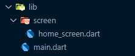
</p>

Karena menggunakan file file yang berbeda, maka ada sedikit perubahan di file `main.dart`. <br>

```dart
import 'package:flutter/material.dart';
import 'package:widget_app/screen/home_screen.dart'; // Import home screen dari file lain

void main() {
  runApp(const MyApp());
}

// Stateless artinya tidak ada perubahan yang dinamis alias statis
// Tidak memerlukan state yang value nya bisa berubah-ubah
class MyApp extends StatelessWidget {
  const MyApp({super.key});

  // build adalah root atau jalur utama dari aplikasi kita
  @override
  Widget build(BuildContext context) {
    return MaterialApp(
        title: 'Widget App Demo',
        theme: ThemeData(
          // Ini adalah tema basic untuk tampilan aplikasi kita
          // Contohnya kita bisa mengubah tema warna dibawah ini menjadi merah
          colorScheme: ColorScheme.fromSeed(seedColor: Colors.red),
          useMaterial3: true,
        ),
        // Untuk menghilangkan banner debug di kanan atas
        debugShowCheckedModeBanner: false,
        // Import HomeScreen dari file yang berbeda
        home: const HomeScreen());
  }
}
```

Pada file `home_screen.dart` hanya berisi tampilan untuk di di halaman atau screen Home saja.

```dart
class HomeScreen extends StatefulWidget {
  const HomeScreen({super.key});

  @override
  State<StatefulWidget> createState() => _HomeScreenState();
}

class _HomeScreenState extends State<HomeScreen> {
  @override
  Widget build(BuildContext context) {
    return ...
  }
}
```

#### Customize AppBar

Membuat tampilan AppBar dengan Text ditengah dengan latar belakang indigo.

```dart
Scaffold(
  appBar: AppBar(
    // Center digunakan agar text tampil di posisi tengah
    title: const Center(
      child: Text("Widget App Part 2"),
    ),
    backgroundColor: Colors.indigo,
    // Foreground disini adalah warna untuk Text
    foregroundColor: Colors.white,
  ),
  body: ...
)
```

<p align="middle">
  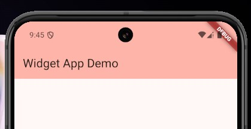
</p>

#### Form Title

```dart
Padding(
  // Padding menggunakan symmetric agar bisa mengatur horizontal dan vertical yang berbeda.
  padding: const EdgeInsets.symmetric(horizontal: 24, vertical: 8),
  // Container digunakan agar dapat memberi kesan kotak dan bisa diberi warna.
  child: Container(
    // MediaQuery width ini bisa diartikan sebagai Full width
    width: MediaQuery.sizeOf(context).width,
    // Alignment center agar konten didalam container ini di tengah
    alignment: Alignment.center,
    // BoxDecoration untuk memberikan border radius, warna, dan styling lainnya
    decoration: BoxDecoration(
        // circular artinya disemua sisi memiliki radius yang sama
        borderRadius: BorderRadius.circular(8),
        color: Colors.indigo.shade50),
    child: const Padding(
      padding: EdgeInsets.symmetric(horizontal: 24, vertical: 8),
      child: Text(
        "Masukkan Identitas Anda",
        style: TextStyle(
            fontSize: 18,
            color: Colors.indigo,
            fontWeight: FontWeight.w500),
      ),
    ),
  ),
),
```

<p align="middle">
  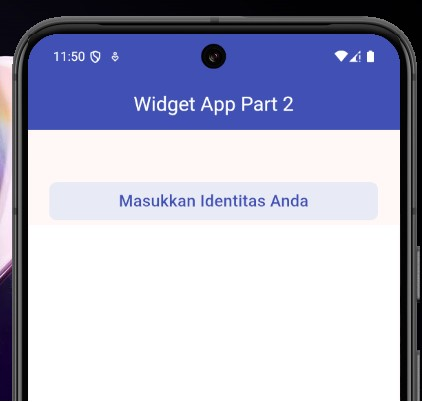
</p>

#### Form Body

Terdapat 2 input text, yaitu Nama dan NPM menggunakan widget `TextField`.

```dart
Padding(
  padding: const EdgeInsets.symmetric(horizontal: 24),
  child: Container(
    width: MediaQuery.sizeOf(context).width,
    decoration: BoxDecoration(
      borderRadius: BorderRadius.circular(8),
      color: Colors.grey.shade200,
    ),
    child: const Padding(
        padding: EdgeInsets.symmetric(horizontal: 12),
        child: TextField(
          // Untuk styling TextField menggunakan InputDecoration
          decoration: InputDecoration(
            // LabelText adalah judul dari inputan
            labelText: "Nama",
            // HintText adalah placeholder/bantuan pengisian data
            hintText: "Masukkan nama...",
            // Disini saya menghilangkan border agar lebih simple
            border: UnderlineInputBorder(
              borderSide: BorderSide.none,
            ),
          ),
        )),
  ),
),
```

<p align="middle">
  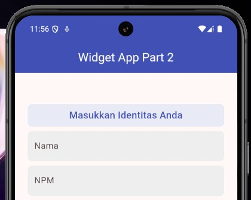
</p>

<p align="middle">
  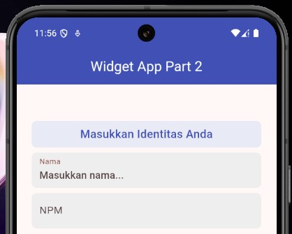
</p>

<p align="middle">
  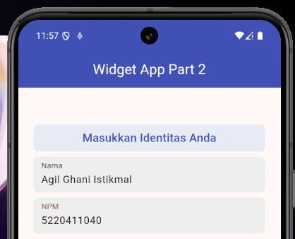
</p>

#### Button

Untuk membuat button di flutter bisa menggunakan widget `TextButton`. Namun saya bungkus menggunakan `Padding` dan `Container` agar tampilan lebih rapi dan menarik.

```dart
Padding(
  padding: const EdgeInsets.symmetric(horizontal: 24),
  child: Container(
    width: MediaQuery.sizeOf(context).width,
    decoration: BoxDecoration(
      borderRadius: BorderRadius.circular(8),
      // Disini saya memberi warna tombol menjadi indigo
      color: Colors.indigo,
    ),
    child: TextButton(
      // Saat Tombol di klik, maka akan mengubah state dan menampilkan datanya di section bawah ini.
      onPressed: () => {},
      // Menggunakan row agar icon dan text tampil secara horizontal
      child: const Row(
        // Main axis alignment center berarti semua konten didalam row akan berada di tengah
        mainAxisAlignment: MainAxisAlignment.center,
        children: [
          // Widget Icon untuk menampilkan Icon yang sudah ada di Flutter
          Icon(
            Icons.send_rounded,
            color: Colors.white,
          ),
          SizedBox(width: 8),
          Text(
            "Next",
            style: TextStyle(color: Colors.white),
          ),
        ],
      ),
    ),
  ),
),
```

<p align="middle">
  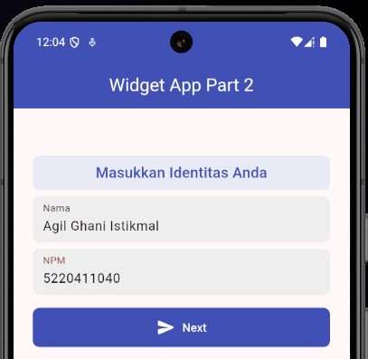
</p>

### ListView Widget

Selanjutnya saya akan mengimplementasikan form dan button sebelumnya untuk menampilkan data di list menggunakan ListView. <br>

ListView seperti column, widget tampil dari atas ke bawah secara vertical, namun dapat discroll sesuai dengan ukuran yang kita tentukan.

#### ListView Builder

```dart
ListView.builder(
  itemCount: 1,
  itemBuilder: (context, index) {
    return Container(
      color: Colors.grey.shade300,
      child: const Padding(
        padding: EdgeInsets.symmetric(horizontal: 24, vertical: 8),
        child: Column(
          children: [Text("NPM"), Text("Nama")],
        ),
      ),
    );
  },
)
```

Namun terdapat error seperti berikut.

<p align="middle">
  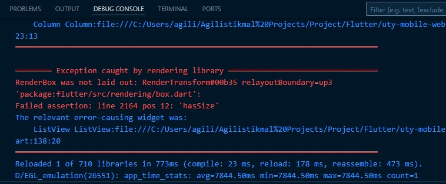
</p>

Setelah diselidiki, ternyata `ListView` tidak bisa langsung didalam child `Column`, harus di wrap menggunakan widget `Expanded` terlebih dahulu. Jadi seperti berikut

```dart
Expanded(
  child: ListView.builder(
    padding: const EdgeInsets.symmetric(horizontal: 24),
    // itemCount adalah jumlah dari item yang akan dibuat, disini menggunakan length dari list agar dinamis
    itemCount: dataList.length,
    // itemBuilder adalah widget yang akan dibuat untuk setiap perulangan sesuai jumlah itemCount
    itemBuilder: (context, index) {
      // Mengambil data dari list sesuai index
      final data = dataList[index];
      return Padding(
        padding: const EdgeInsets.symmetric(vertical: 4),
        child: Container(
          decoration: BoxDecoration(
            borderRadius: BorderRadius.circular(8),
            color: Colors.indigo.shade50,
          ),
          child: Padding(
            padding: const EdgeInsets.symmetric(
                horizontal: 24, vertical: 8),
            child: Column(
              crossAxisAlignment: CrossAxisAlignment.start,
              children: [
                Text(
                  data.npm!,
                  style: const TextStyle(
                    fontWeight: FontWeight.bold,
                    color: Colors.indigo,
                    fontSize: 18,
                  ),
                ),
                Text(
                  data.name!,
                  style: const TextStyle(
                    fontSize: 20,
                    fontWeight: FontWeight.w500,
                  ),
                ),
              ],
            ),
          ),
        ),
      );
    },
  ),
),
```

#### Implementasi Button

Sebelumnya button belum diimplementasikan. Sekarang akan mengimplementasikan button agar setiap button diklik, maka data yang dimasukkan akan disimpan kedalam list agar bisa ditampilkan.

```dart
// Sebagai control dan untuk mengambil nilai TextField
final npmController = TextEditingController();
final nameController = TextEditingController();

// Menyimpan list data
List<Data> dataList = [];

// Untuk menambahkan data ke list
void addToDataList(String npm, String name) {
  setState(() {
    dataList.add(Data(npm: npm, name: name));
  });
}

// Untuk membersihkan TextField saat state dimuat baru
@override
void dispose() {
  npmController.dispose();
  nameController.dispose();
  super.dispose();
}
```

```dart
TextButton(
  // Saat Tombol di klik, maka akan mengubah state dan menampilkan datanya di section bawah ini.
  onPressed: () => {
    // Menambahkan data ke list
    addToDataList(npmController.text, nameController.text),
    // Menghapus value npm dan nama dari textfield
    npmController.clear(),
    nameController.clear()
  },
  // Menggunakan row agar icon dan text tampil secara horizontal
  child: const Row(
    // Main axis alignment center berarti semua konten didalam row akan berada di tengah
    mainAxisAlignment: MainAxisAlignment.center,
    children: [
      // Widget Icon untuk menampilkan Icon yang sudah ada di Flutter
      Icon(
        Icons.send_rounded,
        color: Colors.white,
      ),
      SizedBox(width: 8),
      Text(
        "Next",
        style: TextStyle(color: Colors.white),
      ),
    ],
  ),
),
```

#### Uji Coba Input Data

<p align="center">
  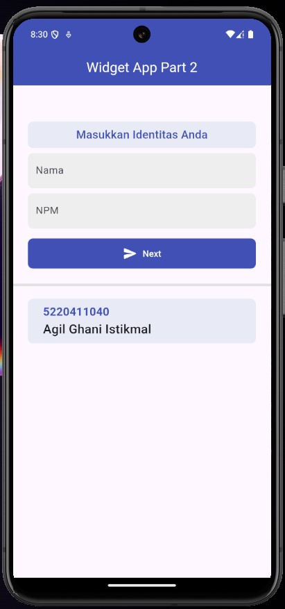
</p>

<p align="center">
  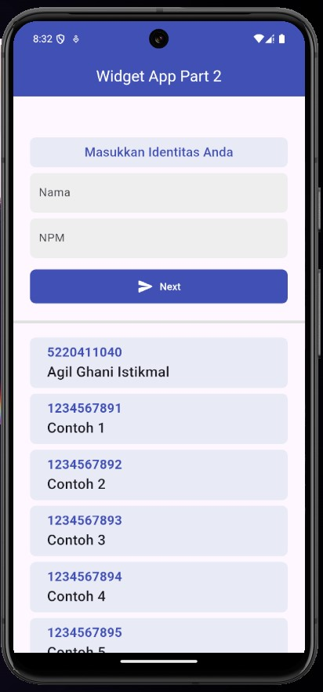
</p>

<p align="center">
  
</p>

### Navigation

Flutter tentu saja bisa melakukan navigasi dari screen satu ke screen lainnya. <br>

#### Membuat Screen Baru

Saya membuat file atau screen baru bernama `another_screen.dart` didalam folder `screen`.

```dart
import 'package:flutter/material.dart';

class AnotherScreen extends StatefulWidget {
  const AnotherScreen({super.key});

  @override
  State<StatefulWidget> createState() => _AnotherScreenState();
}

class _AnotherScreenState extends State<AnotherScreen> {
  @override
  Widget build(BuildContext context) {
    return Scaffold(
      appBar: AppBar(
        title: const Text("Another Screen"),
        backgroundColor: Colors.indigo,
        foregroundColor: Colors.white,
      ),
    );
  }
}
```

Sama seperti Home Screen, namun dibedakan appbar nya agar membedakan.

#### Implementasi Button Navigasi

Pada home screen, saya menambahkan tombol untuk navigasi ke halaman lain.

```dart
Padding(
  padding: const EdgeInsets.symmetric(horizontal: 24),
  child: Container(
    width: MediaQuery.sizeOf(context).width,
    decoration: BoxDecoration(
      borderRadius: BorderRadius.circular(8),
      // Disini saya memberi warna tombol menjadi indigo dengan shade 50
      color: Colors.indigo.shade50,
    ),
    child: TextButton(
      // Saat Tombol di klik, maka akan pindah ke halaman AnotherScreen
      onPressed: () => {
        Navigator.of(context).push(MaterialPageRoute(
          builder: (context) => const AnotherScreen(),
        ))
      },
      // Menggunakan row agar icon dan text tampil secara horizontal
      child: const Row(
        // Main axis alignment center berarti semua konten didalam row akan berada di tengah
        mainAxisAlignment: MainAxisAlignment.center,
        children: [
          // Widget Icon untuk menampilkan Icon yang sudah ada di Flutter
          Icon(
            Icons.navigate_next,
            color: Colors.indigo,
          ),
          SizedBox(width: 8),
          Text(
            "Go to another page",
            style: TextStyle(color: Colors.indigo),
          ),
        ],
      ),
    ),
  ),
),
```

<p align="center">
  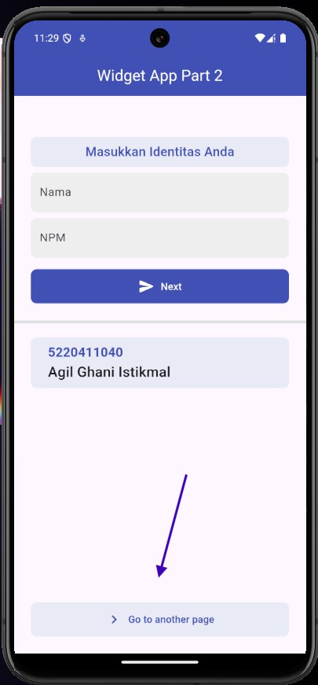
</p>

<p align="center">
  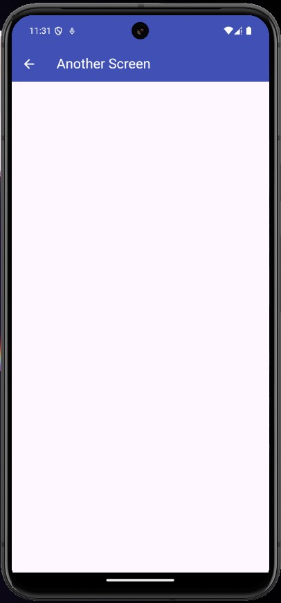
</p>

### GridView

GridView pada dart berguna untuk layouting, grid menentukan jumlah item secara horizontal dibagi dengan 3 misalnya. Maka dalam 1 baris horizontal hanya akan terdapat 3 item, dan sisanya akan diletakkan dibawah.

```dart
GridView(
  gridDelegate: const SliverGridDelegateWithFixedCrossAxisCount(
    // Menentukan maksimal 1 garis horizontal ada berapa item
    crossAxisCount: 3,
  ),
  children: [
    Container(
      color: Colors.red,
      alignment: Alignment.center,
      child: const Text(
        "Child 1",
        style: TextStyle(color: Colors.white, fontSize: 24),
      ),
    ),
    Container(
      color: Colors.yellow,
      alignment: Alignment.center,
      child: const Text(
        "Child 2",
        style: TextStyle(color: Colors.white, fontSize: 24),
      ),
    ),
    Container(
      color: Colors.green,
      alignment: Alignment.center,
      child: const Text(
        "Child 3",
        style: TextStyle(color: Colors.white, fontSize: 24),
      ),
    ),
    Container(
      color: Colors.blue,
      alignment: Alignment.center,
      child: const Text(
        "Child 4",
        style: TextStyle(color: Colors.white, fontSize: 24),
      ),
    )
  ],
),
```

<p align="center">
  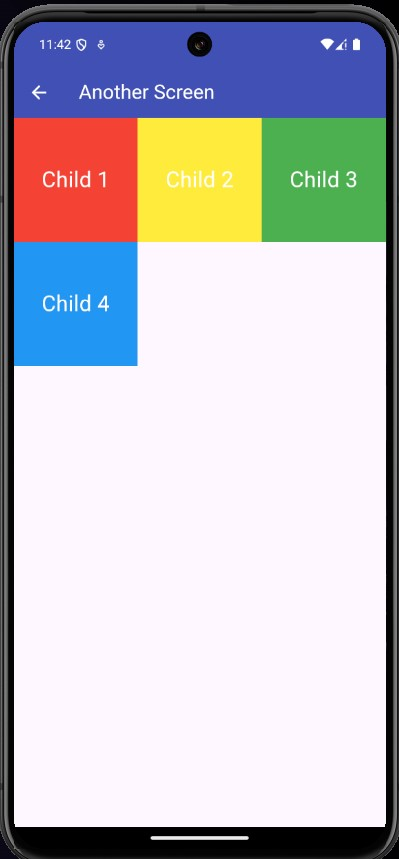
</p>

### Referensi

https://api.flutter.dev/flutter/widgets/widgets-library.html <br>
https://medium.com/@marketing_96275/how-to-create-and-design-buttons-in-flutter-81e87f709348
