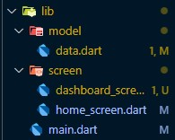
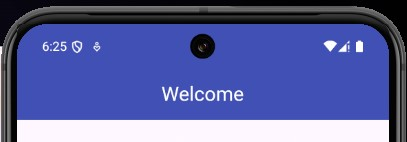
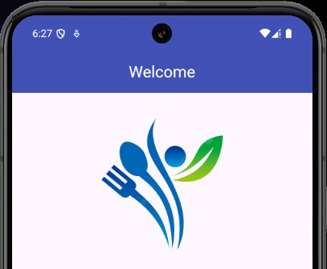
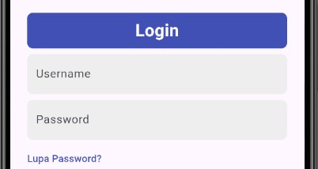
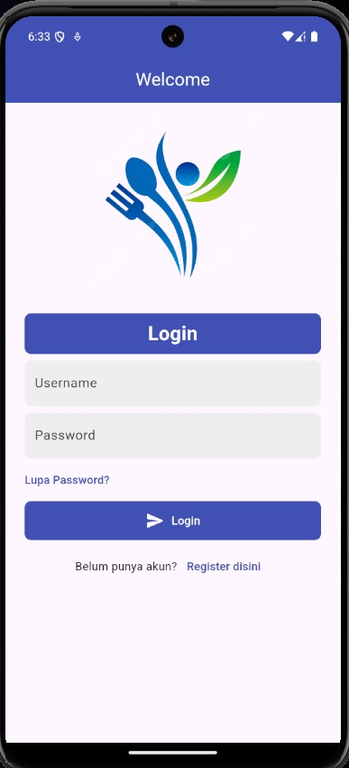
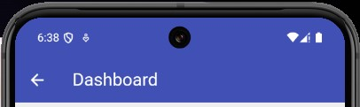
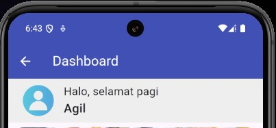
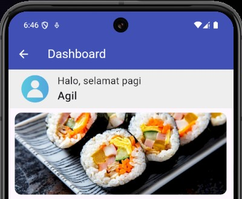
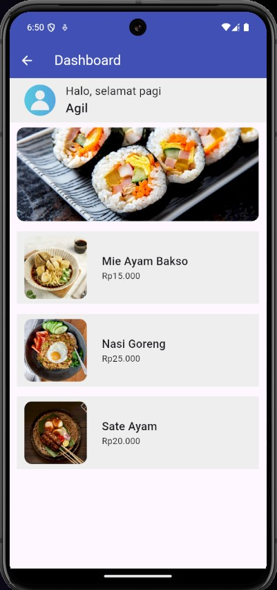

# Pertemuan 4 <!-- omit in toc -->

10 Oktober 2024 <br>
_Note: Kode lengkap aplikasi ini ada di folder github "widget_app"_

### Data Diri

| Nama                | NPM        |
| ------------------- | ---------- |
| Agil Ghani Istikmal | 5220411040 |

### Daftar Isi

- [Data Diri](#data-diri)
- [Daftar Isi](#daftar-isi)
- [Form Login dan Navigasi](#form-login-dan-navigasi)
  - [Struktur](#struktur)
  - [Halaman Form Login](#halaman-form-login)
    - [Controller](#controller)
    - [AppBar](#appbar)
    - [Image](#image)
    - [TextField](#textfield)
    - [Button](#button)
  - [Halaman Dashboard](#halaman-dashboard)
    - [Mengambil Data](#mengambil-data)
  - [Dummy Data](#dummy-data)
    - [AppBar](#appbar-1)
    - [Text Sambutan](#text-sambutan)
    - [Banner](#banner)
    - [ListView](#listview)
- [Referensi](#referensi)

### Form Login dan Navigasi

Pada pertemuan 4 mencoba slicing UI untuk membuat form login dan navigasi ke halaman selanjutnya setelah login.

#### Struktur

Karena akan melakukan navigasi antar screen, maka saya memisahkan setiap screen di masing-masing file.

<p align="center">
  
</p>

`home_screen.dart` adalah halaman Login, dan `dashboard_screen.dart` adalah halaman dashboard setelah login.

`model/data.dart` merupakan class untuk menyimpan data login

```dart
import 'dart:ffi';

class Data {
  String? image;
  String? name;
  String? price;

  Data({this.image, this.name, this.price});
}
```

#### Halaman Form Login

##### Controller

Pertama membuat controller untuk menyimpan data input user agar bisa dicek dan dikirim ke screen lainnya.

```dart
class _HomeScreenState extends State<HomeScreen> {
  // Sebagai control dan untuk mengambil nilai TextField
  final usernameController = TextEditingController();
  final passwordController = TextEditingController();

  // Untuk membersihkan TextField saat state dimuat baru
  @override
  void dispose() {
    usernameController.dispose();
    passwordController.dispose();
    super.dispose();
  }

  ...
}
```

##### AppBar

Appbar sederhana dengan text Welcome ditengah

```dart
AppBar(
  // Center digunakan agar text tampil di posisi tengah
  title: const Center(
    child: Text("Welcome"),
  ),
  backgroundColor: Colors.indigo,
  // Foreground disini adalah warna untuk Text
  foregroundColor: Colors.white,
),
```

<p align="center">
  
</p>

##### Image

Menambahkan Image dari local image menggunakan `Image` dan `AssetImage`

```dart
Image(
  image: AssetImage("assets/logo.png"),
  height: 250,
),
```

<p align="center">
  
</p>

##### TextField

Menambahkan TextField untuk Username dan Password. TextField ini terhubung ke controller yang sudah dibuat sebelumnya.

```dart
Padding(
  padding: const EdgeInsets.symmetric(horizontal: 24),
  child: Container(
    width: MediaQuery.sizeOf(context).width,
    decoration: BoxDecoration(
      borderRadius: BorderRadius.circular(8),
      color: Colors.grey.shade200,
    ),
    child: Padding(
        padding: const EdgeInsets.symmetric(horizontal: 12),
        child: TextField(
          // Untuk styling TextField menggunakan InputDecoration
          decoration: const InputDecoration(
            // LabelText adalah judul dari inputan
            labelText: "Username",
            // HintText adalah placeholder/bantuan pengisian data
            hintText: "Masukkan username...",
            // Disini saya menghilangkan border agar lebih simple
            border: UnderlineInputBorder(
              borderSide: BorderSide.none,
            ),
          ),
          // Menghubungkan ke controller
          controller: usernameController,
        )),
  ),
),
const SizedBox(height: 8),
Padding(
  padding: const EdgeInsets.symmetric(horizontal: 24),
  child: Container(
    width: MediaQuery.sizeOf(context).width,
    decoration: BoxDecoration(
      borderRadius: BorderRadius.circular(8),
      color: Colors.grey.shade200,
    ),
    child: Padding(
        padding: const EdgeInsets.symmetric(horizontal: 12),
        child: TextField(
          obscureText: true,
          decoration: const InputDecoration(
            labelText: "Password",
            hintText: "Masukkan P@ssw0rd...",
            border: UnderlineInputBorder(
              borderSide: BorderSide.none,
            ),
          ),
          controller: passwordController,
        )),
  ),
),
```

<p align="center">
  
</p>

##### Button

Membuat Button yang saat diklik sekaligus mengirim data user ke DashboardScreen

```dart
Padding(
  padding: const EdgeInsets.symmetric(horizontal: 24),
  child: Container(
    width: MediaQuery.sizeOf(context).width,
    decoration: BoxDecoration(
      borderRadius: BorderRadius.circular(8),
      // Disini saya memberi warna tombol menjadi indigo
      color: Colors.indigo,
    ),
    child: TextButton(
      // Saat Tombol di klik, maka akan mengirim datanya ke DashboardScreen
      onPressed: () => {
        Navigator.of(context).push(
          MaterialPageRoute(
            builder: (context) => DashboardScreen(
              username: usernameController,
              password: passwordController,
            ),
          ),
        )
      },
      // Menggunakan row agar icon dan text tampil secara horizontal
      child: const Row(
        // Main axis alignment center berarti semua konten didalam row akan berada di tengah
        mainAxisAlignment: MainAxisAlignment.center,
        children: [
          // Widget Icon untuk menampilkan Icon yang sudah ada di Flutter
          Icon(
            Icons.send_rounded,
            color: Colors.white,
          ),
          SizedBox(width: 8),
          Text(
            "Login",
            style: TextStyle(color: Colors.white),
          ),
        ],
      ),
    ),
  ),
),
```

<p align="center">
  
</p>

#### Halaman Dashboard

##### Mengambil Data

```dart
import 'dart:ffi';

import 'package:flutter/material.dart';
import 'package:widget_app/model/data.dart';

class DashboardScreen extends StatefulWidget {
  // Menyiapkan variable untuk menampung data
  final TextEditingController username;
  final TextEditingController password;

  const DashboardScreen({
    super.key,
    required this.username,
    required this.password,
  });

  @override
  State<StatefulWidget> createState() =>
      // Meneruskan data ke Screen State
      // ignore: no_logic_in_create_state
      _DashboardScreenState(username: username, password: password);
}
```

#### Dummy Data

```dart
class _DashboardScreenState extends State<DashboardScreen> {
  _DashboardScreenState({required this.username, required this.password});

  // Menyiapkan variable untuk menampung data
  final TextEditingController username;
  final TextEditingController password;

  // Membuat data dummy untuk ditampilkan
  final List<Data> datalist = [
    Data(image: "makan1.jpg", name: "Mie Ayam Bakso", price: "15.000"),
    Data(image: "makan2.jpeg", name: "Nasi Goreng", price: "25.000"),
    Data(image: "makan3.jpg", name: "Sate Ayam", price: "20.000"),
  ];

  ...
}
```

##### AppBar

Appbar otomatis memiliki navigasi back ke halaman sebelumnya.

```dart
AppBar(
  title: const Text("Dashboard"),
  backgroundColor: Colors.indigo,
  foregroundColor: Colors.white,
),
```

<p align="center">
  
</p>

##### Text Sambutan

Menambah gambar profil dan username di bagian atas.

```dart
Container(
  color: Colors.grey.shade200,
  child: Padding(
    padding: const EdgeInsets.symmetric(horizontal: 24, vertical: 8),
    child: Row(
      children: [
        // Menambahkan gambar profil dibagian kiri
        const Image(
          image: AssetImage("assets/profile.png"),
          width: 50,
        ),
        // Untuk jarak dari gambar ke text
        const SizedBox(
          width: 16,
        ),
        // Menambahkan column agar text bisa atas bawah
        Column(
          crossAxisAlignment: CrossAxisAlignment.start,
          children: [
            const Text(
              "Halo, selamat pagi",
              style: TextStyle(fontSize: 18),
            ),
            // Mengambil data username
            Text(
              username.text,
              style: const TextStyle(
                  fontSize: 20, fontWeight: FontWeight.w500),
            )
          ],
        ),
      ],
    ),
  ),
),
```

<p align="center">
  
</p>

##### Banner

Menambah Banner dan menggunakan `ClipRRect` agar ada lekukan disudut gambar

```dart
Padding(
  padding: const EdgeInsets.symmetric(horizontal: 12, vertical: 8),
  child: ClipRRect(
    // Agar gambar ada lekukan diujung
    borderRadius: BorderRadius.circular(12),
    child: Image(
        image: const AssetImage("assets/sushi.jpg"),
        // Agar gambar membesar ke ukuran ClipRREct
        fit: BoxFit.cover,
        height: 150,
        // Membuat gambar lebarnya full
        width: MediaQuery.sizeOf(context).width),
  ),
),
```

<p align="center">
  
</p>

##### ListView

Menampilkan seluruh daftar makanan.

```dart
Expanded(
  child: ListView.builder(
    // Mengambil jumlah data
    itemCount: datalist.length,
    itemBuilder: (context, index) {
      return Padding(
        // Memberikan padding
        padding: const EdgeInsets.symmetric(
          horizontal: 12,
          vertical: 8,
        ),
        child: Container(
          color: Colors.grey.shade200,
          child: Padding(
            padding: const EdgeInsets.symmetric(
                horizontal: 12, vertical: 8),
            child: Row(
              children: [
                ClipRRect(
                  // Agar sudut tidak lancip
                  borderRadius: BorderRadius.circular(12),
                  child: Image(
                    // Mengambil gambar sesuai setiap menu
                    image:
                        AssetImage("assets/${datalist[index].image}"),
                    width: 100,
                    height: 100,
                    fit: BoxFit.cover,
                  ),
                ),
                const SizedBox(
                  width: 24,
                ),
                Column(
                  // Agar text rata kiri
                  crossAxisAlignment: CrossAxisAlignment.start,
                  children: [
                    // Mengambil nama sesuai menu
                    Text(
                      "${datalist[index].name}",
                      style: const TextStyle(
                          fontWeight: FontWeight.w500, fontSize: 18),
                    ),
                    // Mengambil harga sesuai menu
                    Text("Rp${datalist[index].price}")
                  ],
                ),
              ],
            ),
          ),
        ),
      );
    },
  ),
),
```

<p align="center">
  
</p>

### Referensi

https://api.flutter.dev/flutter/widgets/widgets-library.html <br>
https://stackoverflow.com/questions/51513429/how-to-do-rounded-corners-image-in-flutter <br>
https://stackoverflow.com/questions/50287995/passing-data-to-statefulwidget-and-accessing-it-in-its-state-in-flutter
