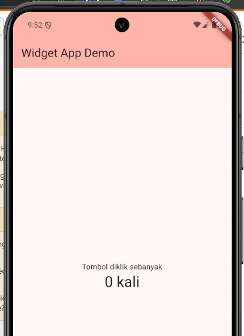
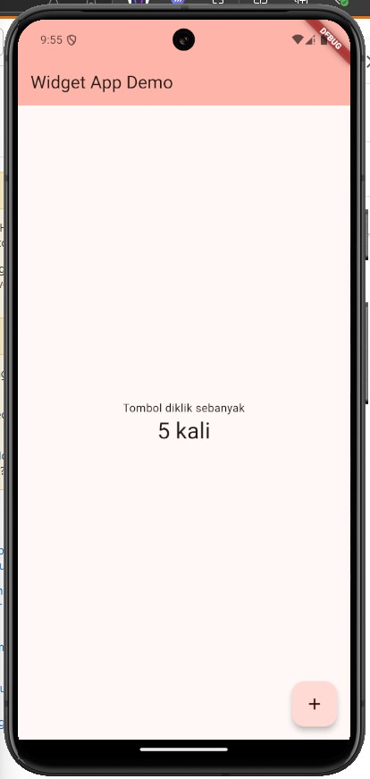
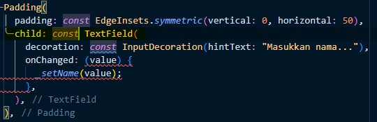
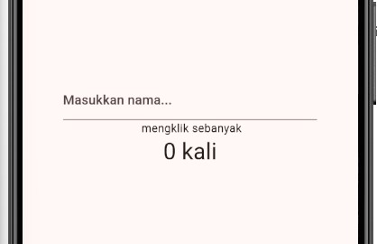
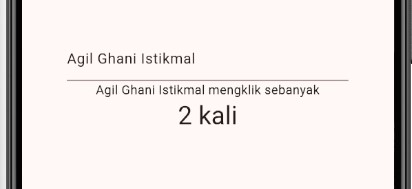

# Pertemuan 2 <!-- omit in toc -->

26 September 2024 <br>
_Note: Kode lengkap aplikasi ini ada di folder github "widget_app"_

### Data Diri

| Nama                | NPM        |
| ------------------- | ---------- |
| Agil Ghani Istikmal | 5220411040 |

### Daftar Isi

- [Data Diri](#data-diri)
- [Daftar Isi](#daftar-isi)
- [Flutter Widget](#flutter-widget)
  - [Stateless dan Stateful Widget](#stateless-dan-stateful-widget)
  - [MaterialApp Widget](#materialapp-widget)
  - [Scaffold Widget](#scaffold-widget)
  - [AppBar Widget](#appbar-widget)
  - [Center](#center)
  - [Column](#column)
  - [FloatingActionButton Widget](#floatingactionbutton-widget)
  - [Menambahkan TextField](#menambahkan-textfield)

### Flutter Widget

Widget adalah hal yang akan sering dijumpai saat membuat aplikasi menggunakan flutter. Semua komponen didalam flutter disebut sebagai widget. <br>
Contohnya saat ingin menampilkan tulisan menggunakan widget Text. <br>
Dibawah ini adalah penjelasan singkat tentang widget dari _default project_ flutter.

#### Stateless dan Stateful Widget

Sebelum masuk lebih dalam, ada 2 jenis utama dalam widget. Yaitu stateless dan stateful widget. <br>
**Stateless Widget** <br>
Stateless widget adalah widget yang nilai dari widget tersebut bernilai tetap atau statis tidak dapat berubah ketika sudah ditampilkan. <br>

```dart
// Stateless artinya tidak ada perubahan yang dinamis alias statis
// Tidak memerlukan state yang value nya bisa berubah-ubah
class MyApp extends StatelessWidget {
  const MyApp({super.key});

  // build adalah root atau jalur utama dari aplikasi kita
  @override
  Widget build(BuildContext context) {
    return ...
  }
}
```

**Stateful Widget** <br>
Sebaliknya, stateful widget berarti nilai didalam widget tersebut dapat berubah saat sudah ditampilkan. Contohnya nilai angka yang bisa berubah saat menekan suatu tombol.

```dart
// Stateful artinya dinamis
// ada state yang value nya bisa berubah-ubah
class MyHomePage extends StatefulWidget {
  const MyHomePage({super.key, required this.title});

  final String title;

  @override
  State<MyHomePage> createState() => _MyHomePageState();
}

class _MyHomePageState extends State<MyHomePage> {
  // nilai ini akan berubah saat menekan tombol
  int _counter = 0;

  void _incrementCounter() {
    setState(() {
      // Saat function ini dijalankan (dengan mengklik tombol)
      // maka nilai counter akan bertambah
      _counter++;
    });
  }

  // build disini akan selalu dibuild ulang saat ada state yang berubah
  @override
  Widget build(BuildContext context) {
    return ...
  }
}
```

#### MaterialApp Widget

MaterialApp adalah tema yang dimiliki oleh google itu sendiri. Dengan widget ini kita bisa mengatur tema terkair aplikasi kita seperti title, colorScheme, dan lain lain.

```dart
MaterialApp(
  title: 'Widget App Demo',
  theme: ThemeData(
    // Ini adalah tema basic untuk tampilan aplikasi kita
    // Contohnya kita bisa mengubah tema warna dibawah ini menjadi merah
    colorScheme: ColorScheme.fromSeed(seedColor: Colors.red),
    useMaterial3: true,
  ),
  home: const MyHomePage(
    // Ini adalah title pada bagian atas aplikasi
    title: 'Widget App Demo',
  ),
);
```

Terlihat didalam widget MaterialApp sendiri juga terdapat widget widget lainnya seperti ThemeData untuk mengisi nilai tema tersebut, dan ColorScheme untuk menentukan warna.

#### Scaffold Widget

Scaffold biasa digunakan sebagai kanvas putih kosong. Didalam scaffold, banyak widget yang bisa ditambahkan.

```dart
Scaffold(
  appBar: ...
  body: ...
  floatingActionButton: ...
);
```

#### AppBar Widget

AppBar adalah widget untuk menampilkan text diposisi atas. Berguna sebagai informasi halaman saat ini.

```dart
AppBar(
  // Background color disini mengambil value dari colorScheme sebelumnya
  // namun warna akan diinverse agar lebih soft
  backgroundColor: Theme.of(context).colorScheme.inversePrimary,
  // widget.title disini mengambil dari value yang ada di MyHomePage diatas
  title: Text(widget.title),
),
```

AppBar juga memerlukan widget Text untuk menampilkan tulisan.

<p align="center">
  
</p>

#### Center

Center digunakan untuk memposisikan child ke posisi tengah layar secara horizontal dan vertical.

```dart
Center(
  // Center untuk mempositikan ke tengah secara horizontal dan vertical
  // Child adalah isi yang akan berada diposisi tengah
  child: ...
),
```

#### Column

Column digunakan untuk membuat banyak widget berurutan kebawah.

```dart
Column(
  // Column adalah kolom yang berisi widget widget lainnya
  // Bisa diatur posisinya
  mainAxisAlignment: MainAxisAlignment.center,
  children: <Widget>[
    const Text(
      'Tombol diklik sebanyak',
    ),
    Text(
      '$_counter kali',
      style: Theme.of(context).textTheme.headlineMedium,
    ),
  ],
),
```

tambahkan const didepan widget text jika text statis, dan apabila text bisa berubah maka tidak ditambahkan const.

<p align="center">
  
</p>

#### FloatingActionButton Widget

Widget ini adalah tombol yang berada dikanan bawah. Pada aplikasi ini, saat tombol ini ditekan maka akan menambahkan value dari jumlah berapa kali tombol ini ditekan.

```dart
FloatingActionButton(
  onPressed: _incrementCounter,
  tooltip: 'Increment',
  child: const Icon(Icons.add),
),
```

<p align="center">
  
</p>

#### Menambahkan TextField

Saatnya eksperimen, saya akan menambahkan text field untuk menginput nama dan akan ditampilkan saat text diubah. <br>
Untuk membuat text field bisa menggunakan widget `TextField`. Saya juga membuat state baru untuk menyimpan data nama.

```dart
String _name = "";

void _setName(String value) {
  setState(() {
    _name = value;
  });
}
```

```dart
TextField(
  decoration: const InputDecoration(hintText: "Masukkan nama..."),
  onChanged: (value) {
    _setName(value);
  },
),
```

`onChanged` akan dijalankan saat ada perubahan huruf di TextField. perlu diperhatikan saat deklarasi widget yang dapat berubah tidak menggunakan const. Sebelumnya saya mendapat error tidak bisa menggunakan `onChanged`.

<p align="center">
  
</p>

TextField saya masukkan ke dalam widget Padding untuk memberikan jarak horizontal.

```dart
<Widget>[
  Padding(
    padding: const EdgeInsets.symmetric(vertical: 0, horizontal: 50),
    child: TextField(
      decoration: const InputDecoration(hintText: "Masukkan nama..."),
      onChanged: (value) {
        _setName(value);
      },
    ),
  ),
  Text(
    '$_name mengklik sebanyak',
  ),
  Text(
    '$_counter kali',
    style: Theme.of(context).textTheme.headlineMedium,
  ),
],
```

<p align="center">
  
</p>

<p align="center">
  
</p>

---

_5220411040 - Agil Ghani Istikmal_
