<div>
  <h3 align="center">
  Laporan Hasil Belajar <br>
  Mobile & Web Service
  </h3>

  <br>
  <br>
  <br>

  <p align="center">
    
  </p>

   <br>
  <br>
  <br>

  <p align="center">
    Disusun oleh: <br>
    Agil Ghani Istikmal
  </p>

   <br>
  <br>
  <br>

  <h3 align="center">
  Program Studi Informatika <br>
  Fakultas Sains Dan Teknologi <br>
  Universitas Teknologi Yogyakarta <br>
  2024
  </h3>
</div>

# Data Diri

| Nama                | NPM        |
| ------------------- | ---------- |
| Agil Ghani Istikmal | 5220411040 |

# Disclaimer

Untuk kode program ada di repository berikut: <br>
- Flutter: https://github.com/Agilistikmal/uty-mobile-web-service/
- REST Api: https://github.com/Agilistikmal/uty-mobile-web-service-api/

# Daftar Isi
- [Data Diri](#data-diri)
- [Daftar Isi](#daftar-isi)
- [Pertemuan 1](#pertemuan-1)
    - [Data Diri](#data-diri-1)
    - [1. Review Bahasa Pemrograman](#1-review-bahasa-pemrograman)
      - [Mobile Client](#mobile-client)
      - [Web Client](#web-client)
      - [Web Server](#web-server)
    - [1.1 Review Beberapa Bahasa Pemrograman Yang Pernah Digunakan](#11-review-beberapa-bahasa-pemrograman-yang-pernah-digunakan)
      - [1.1.1 Java](#111-java)
      - [1.1.2 Javascript](#112-javascript)
      - [1.1.3 TypeScript](#113-typescript)
      - [1.1.4 Python](#114-python)
      - [1.1.5 Golang (Favorit)](#115-golang-favorit)
      - [1.1.6 Kotlin](#116-kotlin)
      - [1.1.7 Dart](#117-dart)
      - [1.1.8 Rust](#118-rust)
    - [2. Menginstall Flutter](#2-menginstall-flutter)
      - [2.1 Android Studio](#21-android-studio)
      - [2.2 Flutter](#22-flutter)
    - [3. Mencoba Android Studio dan Flutter](#3-mencoba-android-studio-dan-flutter)
    - [4. Program Hello World Di Beberapa Bahasa Pemrograman](#4-program-hello-world-di-beberapa-bahasa-pemrograman)
      - [4.1 Java](#41-java)
      - [4.2 Javascript](#42-javascript)
      - [4.3 Typescript](#43-typescript)
      - [4.4 Python](#44-python)
      - [4.5 Golang](#45-golang)
      - [4.6 Kotlin](#46-kotlin)
      - [4.7 Dart](#47-dart)
      - [4.8 Rust](#48-rust)
- [Pertemuan 2](#pertemuan-2)
    - [Data Diri](#data-diri-2)
    - [Flutter Widget](#flutter-widget)
      - [Stateless dan Stateful Widget](#stateless-dan-stateful-widget)
      - [MaterialApp Widget](#materialapp-widget)
      - [Scaffold Widget](#scaffold-widget)
      - [AppBar Widget](#appbar-widget)
      - [Center](#center)
      - [Column](#column)
      - [FloatingActionButton Widget](#floatingactionbutton-widget)
      - [Menambahkan TextField](#menambahkan-textfield)
    - [Referensi](#referensi)
- [Pertemuan 3](#pertemuan-3)
    - [Data Diri](#data-diri-3)
    - [Flutter Widget Lanjutan](#flutter-widget-lanjutan)
      - [Struktur File](#struktur-file)
      - [Customize AppBar](#customize-appbar)
      - [Form Title](#form-title)
      - [Form Body](#form-body)
      - [Button](#button)
    - [ListView Widget](#listview-widget)
      - [ListView Builder](#listview-builder)
      - [Implementasi Button](#implementasi-button)
      - [Uji Coba Input Data](#uji-coba-input-data)
    - [Navigation](#navigation)
      - [Membuat Screen Baru](#membuat-screen-baru)
      - [Implementasi Button Navigasi](#implementasi-button-navigasi)
    - [GridView](#gridview)
    - [Referensi](#referensi-1)
- [Pertemuan 4](#pertemuan-4)
    - [Data Diri](#data-diri-4)
    - [Form Login dan Navigasi](#form-login-dan-navigasi)
      - [Struktur](#struktur)
      - [Halaman Form Login](#halaman-form-login)
        - [Controller](#controller)
        - [AppBar](#appbar)
        - [Image](#image)
        - [TextField](#textfield)
        - [Button](#button-1)
      - [Halaman Dashboard](#halaman-dashboard)
        - [Mengambil Data](#mengambil-data)
      - [Dummy Data](#dummy-data)
        - [AppBar](#appbar-1)
        - [Text Sambutan](#text-sambutan)
        - [Banner](#banner)
        - [ListView](#listview)
    - [Referensi](#referensi-2)
- [Pertemuan 5](#pertemuan-5)
  - [Data diri](#data-diri-5)
  - [Design Figma](#design-figma)
  - [REST API](#rest-api)
    - [HTTP Methods](#http-methods)
      - [GET](#get)
        - [GET /user](#get-user)
        - [GET /user/:username](#get-userusername)
      - [POST](#post)
        - [POST /user](#post-user)
      - [PUT](#put)
        - [PUT /user/:username](#put-userusername)
      - [PATCH](#patch)
        - [PATCH /user/:username](#patch-userusername)
      - [DELETE](#delete)
        - [DELETE /user/:username](#delete-userusername)
  - [API User Login](#api-user-login)
    - [Struktur Folder](#struktur-folder)
    - [Model](#model)
      - [User Model](#user-model)
      - [Response Model](#response-model)
    - [Repository](#repository)
    - [Service](#service)
    - [Delivery REST API Handler](#delivery-rest-api-handler)
      - [user\_handler.go](#user_handlergo)
      - [route.go](#routego)
    - [Main](#main)
    - [Testing Postman](#testing-postman)
      - [Register - Error Validation](#register---error-validation)
      - [Register - Success](#register---success)
      - [Login - Error Invalid Password](#login---error-invalid-password)
      - [Login - Success](#login---success)
- [Pertemuan 6](#pertemuan-6)
  - [Data diri](#data-diri-6)
  - [Konversi Figma ke Flutter](#konversi-figma-ke-flutter)
    - [Login \& Register](#login--register)
    - [OTP \& Home](#otp--home)
    - [Payment](#payment)
    - [Home (Verified)](#home-verified)
  - [API OTP](#api-otp)
    - [Send OTP](#send-otp)
    - [Send OTP - Golang](#send-otp---golang)
      - [OTP Model](#otp-model)
      - [OTP Repository](#otp-repository)
      - [OTP Service](#otp-service)
  - [API Payment Gateway](#api-payment-gateway)
    - [Payment Model](#payment-model)
    - [Payment Repository](#payment-repository)
    - [Payment Service - Create](#payment-service---create)
    - [Payment Service - Find](#payment-service---find)
  - [Integrasi Flutter dan API](#integrasi-flutter-dan-api)
    - [Import HTTP](#import-http)
    - [Login](#login)
    - [Register](#register)
    - [OTP Verify](#otp-verify)
    - [Upgrade Account (Create Payment)](#upgrade-account-create-payment)
    - [WebView Xendit/Payment](#webview-xenditpayment)
    - [Confirm/Refresh Payment Status](#confirmrefresh-payment-status)
  - [Referensi](#referensi-3)
- [Referensi Keseluruhan](#referensi-keseluruhan)


# Pertemuan 1 

19 September 2024

### Data Diri

| Nama                | NPM        |
| ------------------- | ---------- |
| Agil Ghani Istikmal | 5220411040 |

---

### 1. Review Bahasa Pemrograman

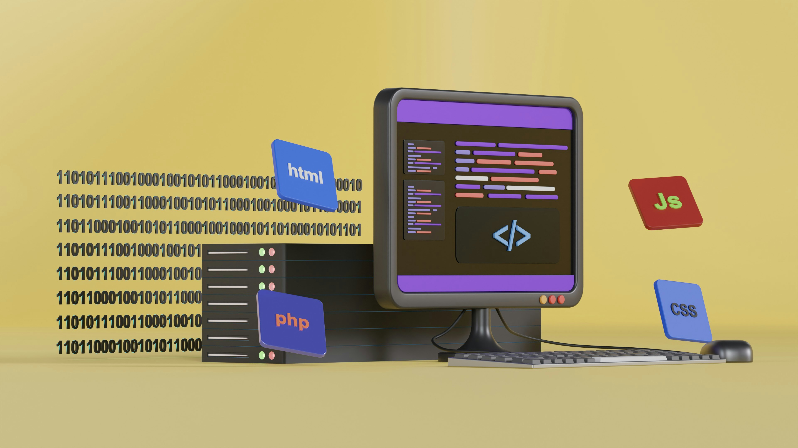
Ada banyak bahasa pemrograman serta framework yang sering digunakan untuk keperluan mobile dan web service. Ada bahasa pemrograman yang secara langsung bisa digunakan untuk membuat aplikasi mobile (Android/iOS) maupun yang memerlukan bantuan framework atau library untuk membuat aplikasi mobile Android/iOS atau multi-platform (Android/iOS/Desktop).

#### Mobile Client

Mobile Client adalah aplikasi yang menampilkan tampilan kepada user melalui device Android atau iOS. Beberapa bahasa pemrograman yang populer digunakan sebagai berikut:

- Java
- Kotlin
- Javascript (menggunakan React Native)
- Dart (menggunakan Flutter)

#### Web Client

Web Client adalah aplikasi yang menampilkan tampilan kepada user melalui browser. Banyak library/framework populer saat ini yang memakai bahasa pemrograman JavaScript sebagai dasar atau inti dari teknologi mereka, karena saat ini hanya JavaScript yang bisa berjalan langsung di browser. Namun, bahasa pemrograman seperti PHP juga tetap masih banyak yang menggunakan.

- PHP
- PHP framework (Laravel, Codeigniter, dan lain lain)
- Javascript
- Javascript library/framework (React, Angular, Svelte, Vue, dan lain lain)

#### Web Server

- Javascript/Typescript (NodeJS, Bun, Deno, dan lain lain)
- Javascript/Typescript framework (ExpressJS, NextJS, NestJS, Hono, ElysiaJS, dan lain lain)
- Go
- Go framework (Fiber, Gin, dan lain lain)
- Python
- Python framework (Django, Flask, dan lain lain)

### 1.1 Review Beberapa Bahasa Pemrograman Yang Pernah Digunakan

#### 1.1.1 Java

<p align="center">
  
</p>

Bahasa Pemrograman Java adalah bahasa yang pertama kali saya pelajari saat mengenal dunia pemrograman. Saat itu saya masih menjadi siswa SMP. <br>
Tentu saja, saya sebagai anak SMP, java sangat membingungkan pada saat itu. Awalnya saya mempelajari bagaimana cara membuat plugin untuk game [Minecraft](https://minecraft.net). Saya mencari dan meniru tutorial yang ada di YouTube. <br>
Sekarang saya tidak terlalu kesulitan seperti dulu untuk menggunakan Bahasa Pemrograman Java. <br>
Karena pertama kali terjun ke dunia pemrograman menggunakan Java, saya merasa lebih mudah untuk mempelajari bahasa pemrograman lainnya karena Java adalah bahasa pemrograman yang terbilang komplit dan banyak menginspirasi bahasa pemrograman baru lainnya.

#### 1.1.2 Javascript

<p align="center">
  
</p>

Bahasa Pemrograman ke-2 yang saya pelajari adalah JavaScript. Dulu saya berpikir Java dan JavaScript adalah Bahasa Pemrograman yang sama, namun ternyata JavaScript berbeda dari Java. <br>

Saya belajar JavaScript untuk belajar membuat website yang interaktif, karena JavaScript adalah bahasa yang dapat berjalan di browser secara langsung. <br>

Saya tetap kesulitan, namun tidak sesulit saat mempelajari Java. Karena banyak syntax syntax yang cara penulisannya mirip dengan Java. Namun, JavaScript tidak memerlukan dan dapat berjalan tanpa class dan main function.

#### 1.1.3 TypeScript

<p align="center">
  
</p>

Karena permasalahan di Javascript, saya memutuskan untuk mempelajari bahasa pemrograman ke-3 saya yaitu TypeScript. <br>

Javascript memiliki masalah pada typesafe. Javascript tidak strict terhadap tipe data yang tidak terdeteksi error saat melakukan coding, namun bisa error saat dijalankan, dan itu sangat merepotkan untuk mencari titik kesalahan. <br>

Saya mencari solusi dan menemukan jawaban bahwa TypeScript adalah solusi untuk masalah tersebut.

#### 1.1.4 Python

<p align="center">
  
</p>

Masuk ke era Machine Learning dan AI, saya penasaran dan mempelajari bahasa pemrograman ke-4 saya yaitu Python. <br>

Saat pertama kali mempelajari Python, saya kaget karena syntax dan style cara menulis kode python sangat berbeda dari 3 bahasa yang sebelumnya saya pelajari. <br>

Python lebih menggunakan ":" dibanding "{ }" untuk class, function, serta looping. <br>

Sedikit membingungkan diawal, namun terasa simple saat sudah memahaminya.

#### 1.1.5 Golang (Favorit)

<p align="center">
  
</p>

Penasaran dengan kepopuleran bahasa pemrograman Go, saya pun mempelajari Golang sebagai bahasa pemrograman ke-5 saya. Dan saat ini menjadi bahasa pemrograman favorit saya. <br>

Golang dikenal dengan kecepatannya. Namun yang membuat saya menjadikan Golang bahasa pemrograman favorit adalah Simple, Strict, Safe. <br>

Syntax Golang memang terlihat tidak simple, namun menurut saya itu adalah syntax yang mudah dimengerti. <br>

Golang adalah bahasa pemrograman yang sangat strict, error akan diketahui saat melakukan coding, dan minim error yang tidak terduga setelah aplikasi dijalankan. <br>

Saya biasa menggunakan Go untuk membuat backend API tanpa menggunakan framework, karena built-in package golang sudah sangat mencukupi.

#### 1.1.6 Kotlin

<p align="center">
  
</p>

Tidak puas di web, saya mempelajari Kotlin sebagai bahasa pemrograman saya ke-6 untuk membuat aplikasi mobile Android. <br>

Aplikasi Android juga bisa dibuat menggunakan Kotlin, karena Kotlin berjalan di Java Virtual Machine. <br>

#### 1.1.7 Dart

<p align="center">
  
</p>

Ingin agar aplikasi android juga berjalan di iOS, saya mempelajari bahasa pemrograman Dart sebagai bahasa pemrograman ke-7 saya, dan menggunakan framework Flutter untuk membuat aplikasi multi-platform. <br>

Flutter sangat memudahkan untuk membuat aplikasi multi-platform, syntax yang sederhana dan mengandalkan widget untuk membuat fungsionalitas aplikasi.

#### 1.1.8 Rust

<p align="center">
  
</p>

Rust adalah bahasa pemrograman yang sedang saya pelajari sekarang. Rust terkenal dengan kecepatannya yang katanya mengalahkan Golang. <br>

---

### 2. Menginstall Flutter

Sebelumnya kita sudah mengenal Dart dan mengetahui Flutter untuk mengembangkan aplikasi multi-platform khususnya Android/iOS. <br>

Sekarang saya akan mencoba menginstall Android Studio untuk menggunakan Virtual Device, lalu menginstall Flutter.

#### 2.1 Android Studio

Pergi ke halaman https://developer.android.com/studio dan klik Download. <br>
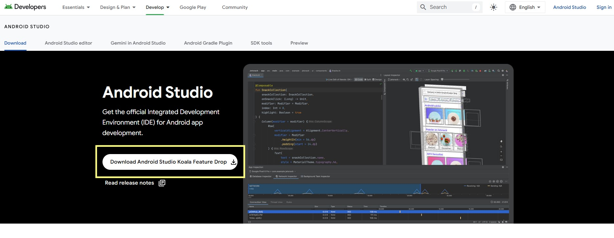

Setelah download selesai, buka file `.exe`.

<p align="center">
  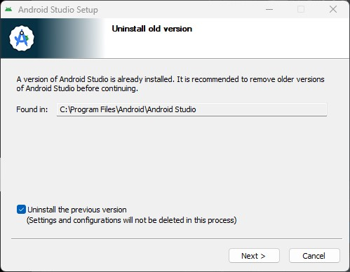
</p>

Karena sebelumnya saya sudah menginstall versi sebelumnya, maka saya akan uninstall terlebih dahulu. Selanjutnya ikuti seperti gambar dibawah ini.

<p align="center">
  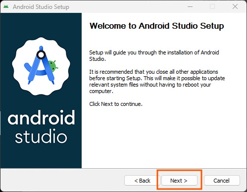
</p>

<p align="center">
  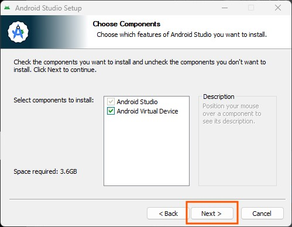
</p>
<p align="center">
  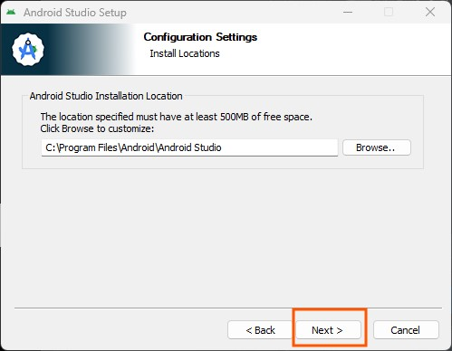
</p>
<p align="center">
  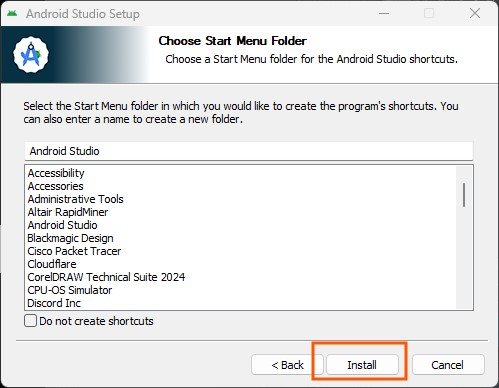
</p>
<p align="center">
  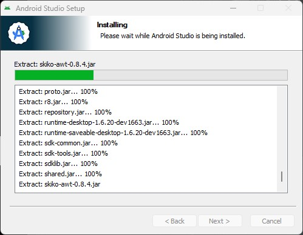
</p>
<p align="center">
  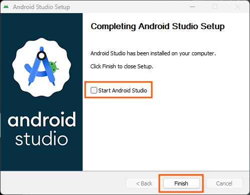
</p>

Karena saya akan mencoba Android Studio setelah menginstall Flutter, maka saya tidak mencentang "Start Android Studio" terlebih dahulu.

#### 2.2 Flutter

Pergi ke halaman https://docs.flutter.dev/get-started/install dan pilih sistem operasi.

<p align="center">
  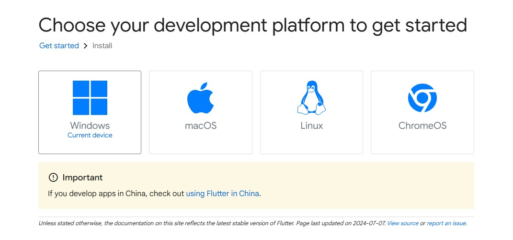
</p>

<p align="center">
  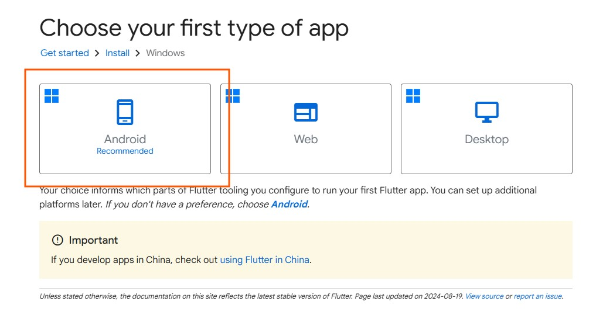
</p>
<p align="center">
  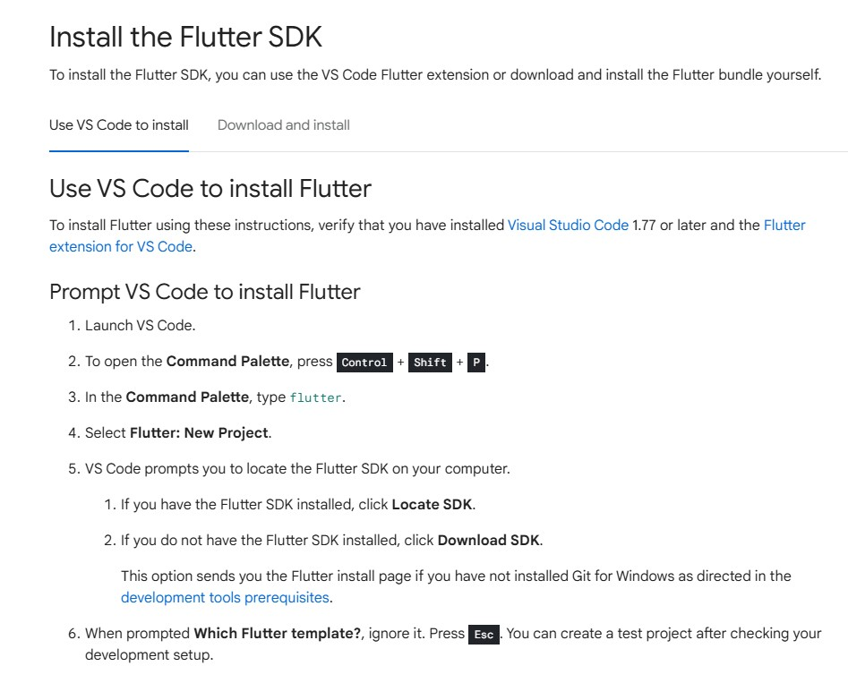
</p>

Terdapat pilihan menginstall melalui Vistual Studio Code. Saya akan memilih itu saja karena lebih mudah.

<p align="center">
  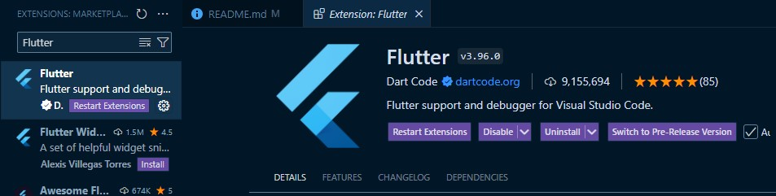
</p>

Cari dan Install Extension Flutter di Visual Studio Code.

<p align="center">
  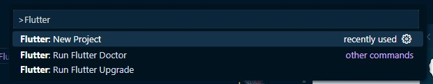
</p>

`CTRL + SHIFT + P` lalu ketik `Flutter:` dan pilih New Project.

<p align="center">
  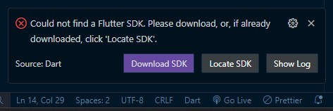
</p>

Jika ada error seperti diatas, klik Download SDK jika belum download.

<p align="center">
  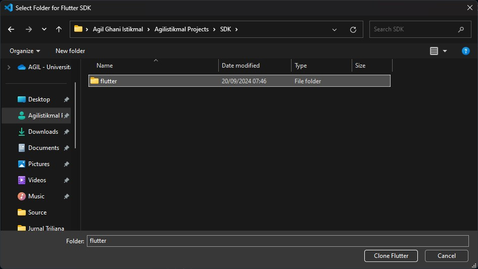
</p>

Pilih folder untuk menyimpan SDK.

<p align="center">
  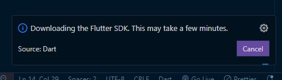
</p>

<p align="center">
  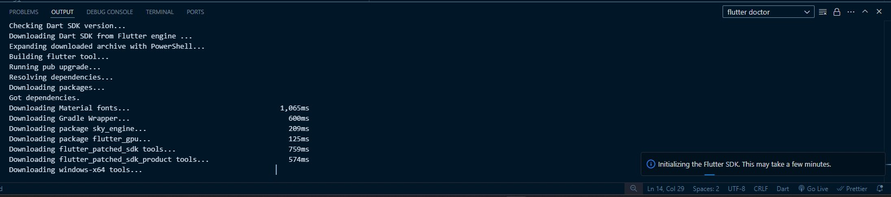
</p>

<p align="center">
  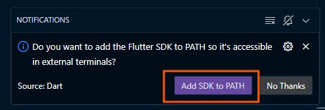
</p>

Tambahkan SDK ke PATH seperti diatas.

<p align="center">
  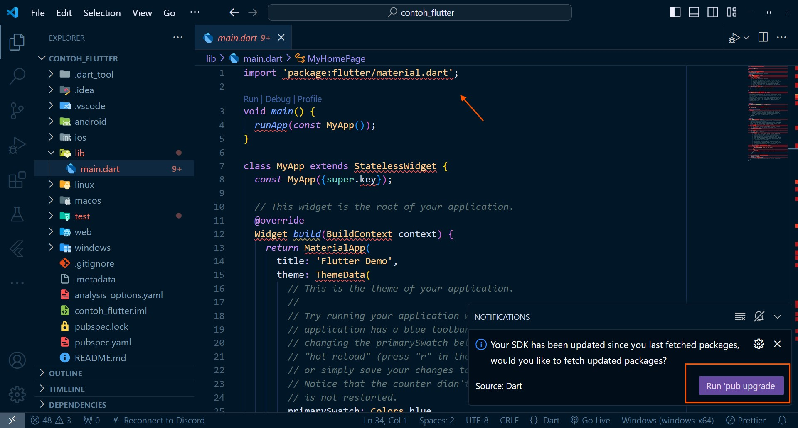
</p>

Jika ada error di kode program seperti diatas, jalankan `pub upgrade` seperti di kanan bawah. <br>
Selesai.

---

### 3. Mencoba Android Studio dan Flutter

Pertama buka dan buat Virtual Device di Android Studio. Caranya seperti dibawah ini.

<p align="center">
  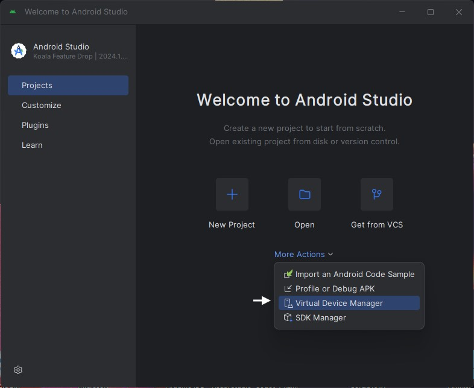
</p>
<p align="center">
  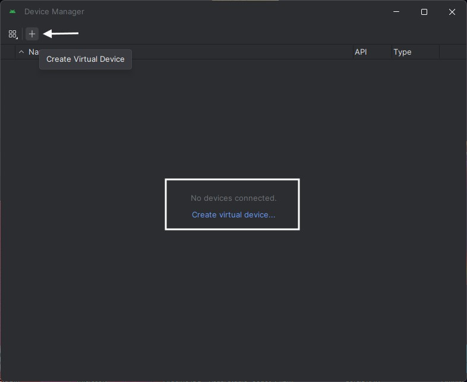
</p>
<p align="center">
  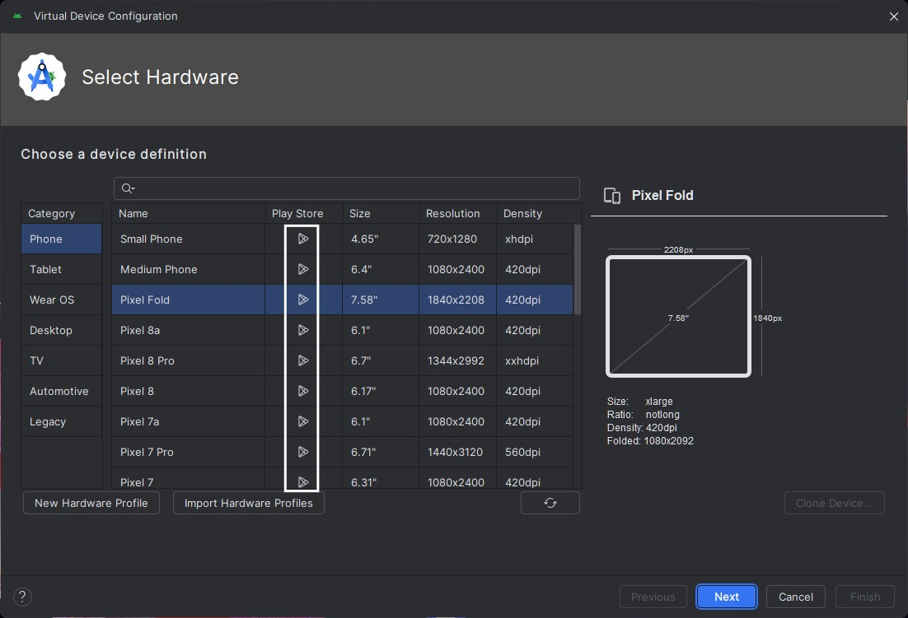
</p>
<p align="center">
  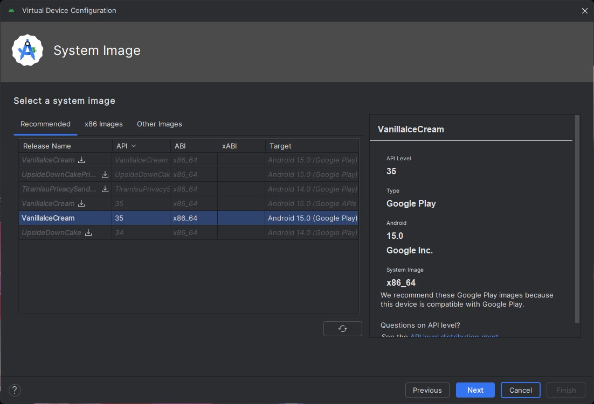
</p>
<p align="center">
  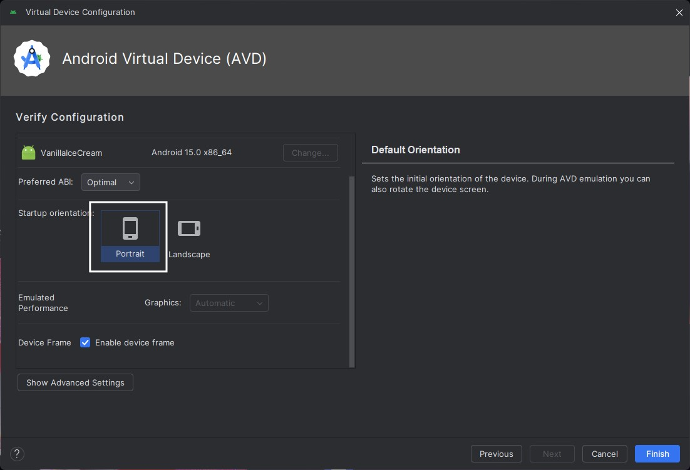
</p>
<p align="center">
  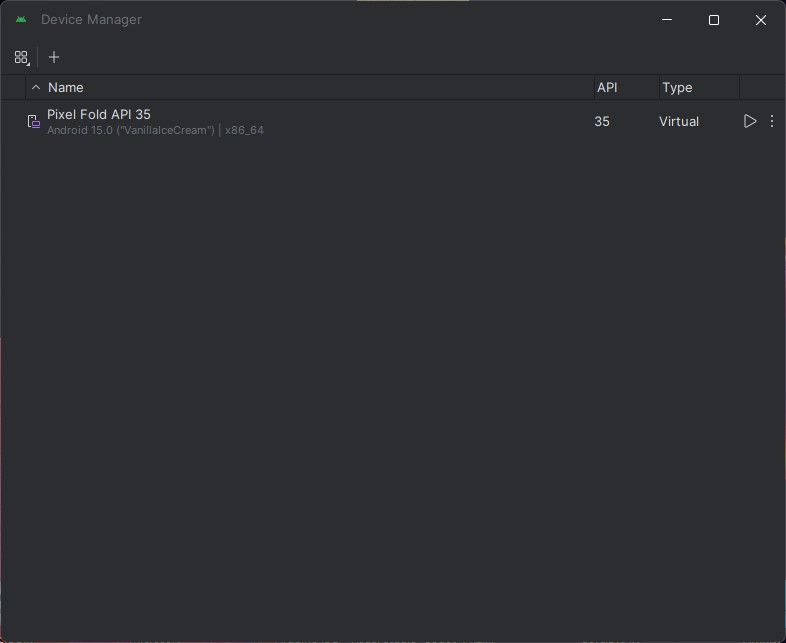
</p>

Selanjutnya, buka dan jalankan aplikasi Flutter di Visual Studio Code.

<p align="center">
  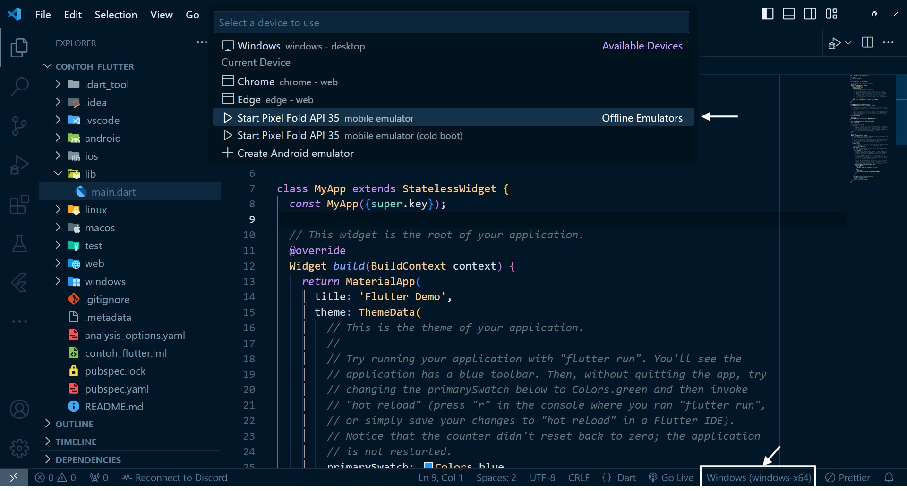
</p>

Pilih Device yang ingin digunakan. Lalu jalankan `flutter run` di terminal.

<p align="center">
  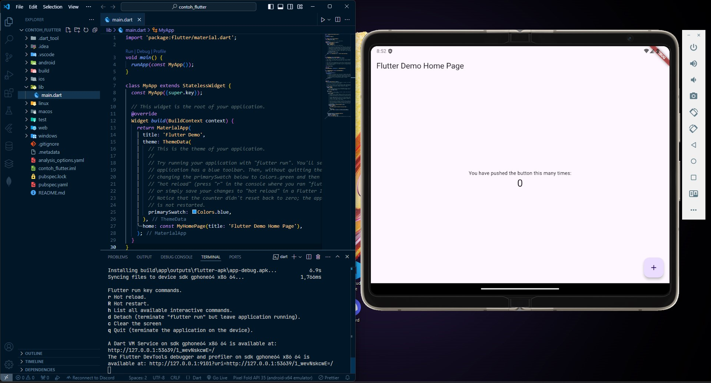
</p>

---

### 4. Program Hello World Di Beberapa Bahasa Pemrograman

Berikut adalah cara penulisan kode untuk menampilkan text "Hello World" di beberapa bahasa pemrograman.

#### 4.1 Java

```java
class Contoh {
    public static void main(String []args) {
        System.out.println("Hello World");
    }
}
```

Seperti kode diatas, untum menampilkan "Hello World" saja memerlukan beberapa step, mulai dari class, main function, dan memanggil fungsi println.

```java
// Error
class Contoh {
    public static void main(String []args) {
        // Lupa titik koma
        System.out.println("Hello World") <--
    }
}
```

Banyak programmer pemula yang mendapatkan error karena hal kecil seperti titik koma.

#### 4.2 Javascript

```js
console.log("Hello World");
```

Javascript tidak memerlukan class dan main function untuk menajalankan program. Cukup langsung memanggil fungsi console.log("text") sudah bisa menampilkan suatu text.

#### 4.3 Typescript

```js
console.log("Hello World");
```

Untuk menampilkan "Hello WOrld", TypeScript sama seperti Javascript.

#### 4.4 Python

```py
print("Hello World")
```

Python sangat sederhana dibandingkan yang lain.

#### 4.5 Golang

```go
package main

func main() {
  fmt.Println("Hello World")
}
```

Golang memerlukan deklarasi package dan main function untuk menjalankan program.

```go
// Error
package main

func main() {
  // huruf p kecil
  fmt.println("Hello World")
}
```

Hati hati saat menulis kode di Golang, huruf depan diawali dengan huruf kapital untuk fungsi yang bersifat Public, dan huruf kecil yang bersifat Private.

#### 4.6 Kotlin

```kt
fun main(args : Array<String>) {
    println("Hello World")
}
```

Kotlin terlihat lebih sederhana daripada Java.

#### 4.7 Dart

```dart
void main() {
  print('Hello World');
}
```

Dart lebih sederhana lagi jika dibandingkan dengan Kotlin.

#### 4.8 Rust

```rs
fn main() {
    println!("Hello World");
}
```

Untuk sekedar menampilkan "Hello World", Rust memang terlihat mudah. Namun, untuk kasus lainnya Rust terkesan kompleks. <br>

```rs
// Error
fn main() {
    println!("Hello World") <--
}
```

Hati hati terhadap `;` diakhir, karena Rust wajib menggunakan titik koma.

---

# Pertemuan 2 

26 September 2024 <br>
_Note: Kode lengkap aplikasi ini ada di folder github "widget_app"_

### Data Diri

| Nama                | NPM        |
| ------------------- | ---------- |
| Agil Ghani Istikmal | 5220411040 |

### Flutter Widget

Widget adalah hal yang akan sering dijumpai saat membuat aplikasi menggunakan flutter. Semua komponen didalam flutter disebut sebagai widget. <br>
Contohnya saat ingin menampilkan tulisan menggunakan widget Text. <br>
Dibawah ini adalah penjelasan singkat tentang widget dari _default project_ flutter.

#### Stateless dan Stateful Widget

Sebelum masuk lebih dalam, ada 2 jenis utama dalam widget. Yaitu stateless dan stateful widget. <br>
**Stateless Widget** <br>
Stateless widget adalah widget yang nilai dari widget tersebut bernilai tetap atau statis tidak dapat berubah ketika sudah ditampilkan. <br>

```dart
// Stateless artinya tidak ada perubahan yang dinamis alias statis
// Tidak memerlukan state yang value nya bisa berubah-ubah
class MyApp extends StatelessWidget {
  const MyApp({super.key});

  // build adalah root atau jalur utama dari aplikasi kita
  @override
  Widget build(BuildContext context) {
    return ...
  }
}
```

**Stateful Widget** <br>
Sebaliknya, stateful widget berarti nilai didalam widget tersebut dapat berubah saat sudah ditampilkan. Contohnya nilai angka yang bisa berubah saat menekan suatu tombol.

```dart
// Stateful artinya dinamis
// ada state yang value nya bisa berubah-ubah
class MyHomePage extends StatefulWidget {
  const MyHomePage({super.key, required this.title});

  final String title;

  @override
  State<MyHomePage> createState() => _MyHomePageState();
}

class _MyHomePageState extends State<MyHomePage> {
  // nilai ini akan berubah saat menekan tombol
  int _counter = 0;

  void _incrementCounter() {
    setState(() {
      // Saat function ini dijalankan (dengan mengklik tombol)
      // maka nilai counter akan bertambah
      _counter++;
    });
  }

  // build disini akan selalu dibuild ulang saat ada state yang berubah
  @override
  Widget build(BuildContext context) {
    return ...
  }
}
```

#### MaterialApp Widget

MaterialApp adalah tema yang dimiliki oleh google itu sendiri. Dengan widget ini kita bisa mengatur tema terkair aplikasi kita seperti title, colorScheme, dan lain lain.

```dart
MaterialApp(
  title: 'Widget App Demo',
  theme: ThemeData(
    // Ini adalah tema basic untuk tampilan aplikasi kita
    // Contohnya kita bisa mengubah tema warna dibawah ini menjadi merah
    colorScheme: ColorScheme.fromSeed(seedColor: Colors.red),
    useMaterial3: true,
  ),
  home: const MyHomePage(
    // Ini adalah title pada bagian atas aplikasi
    title: 'Widget App Demo',
  ),
);
```

Terlihat didalam widget MaterialApp sendiri juga terdapat widget widget lainnya seperti ThemeData untuk mengisi nilai tema tersebut, dan ColorScheme untuk menentukan warna.

#### Scaffold Widget

Scaffold biasa digunakan sebagai kanvas putih kosong. Didalam scaffold, banyak widget yang bisa ditambahkan.

```dart
Scaffold(
  appBar: ...
  body: ...
  floatingActionButton: ...
);
```

#### AppBar Widget

AppBar adalah widget untuk menampilkan text diposisi atas. Berguna sebagai informasi halaman saat ini.

```dart
AppBar(
  // Background color disini mengambil value dari colorScheme sebelumnya
  // namun warna akan diinverse agar lebih soft
  backgroundColor: Theme.of(context).colorScheme.inversePrimary,
  // widget.title disini mengambil dari value yang ada di MyHomePage diatas
  title: Text(widget.title),
),
```

AppBar juga memerlukan widget Text untuk menampilkan tulisan.

<p align="center">
  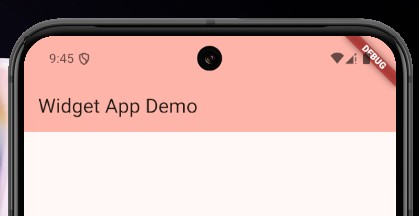
</p>

#### Center

Center digunakan untuk memposisikan child ke posisi tengah layar secara horizontal dan vertical.

```dart
Center(
  // Center untuk mempositikan ke tengah secara horizontal dan vertical
  // Child adalah isi yang akan berada diposisi tengah
  child: ...
),
```

#### Column

Column digunakan untuk membuat banyak widget berurutan kebawah.

```dart
Column(
  // Column adalah kolom yang berisi widget widget lainnya
  // Bisa diatur posisinya
  mainAxisAlignment: MainAxisAlignment.center,
  children: <Widget>[
    const Text(
      'Tombol diklik sebanyak',
    ),
    Text(
      '$_counter kali',
      style: Theme.of(context).textTheme.headlineMedium,
    ),
  ],
),
```

tambahkan const didepan widget text jika text statis, dan apabila text bisa berubah maka tidak ditambahkan const.

<p align="center">
  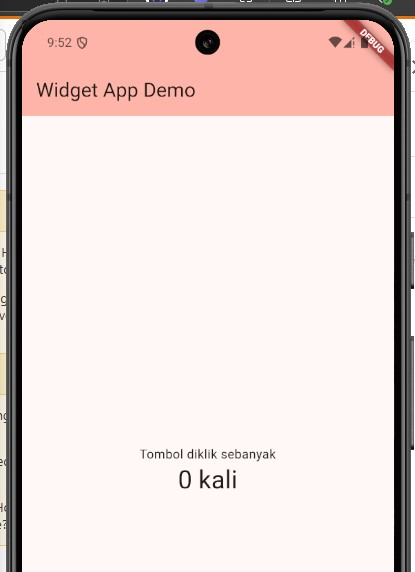
</p>

#### FloatingActionButton Widget

Widget ini adalah tombol yang berada dikanan bawah. Pada aplikasi ini, saat tombol ini ditekan maka akan menambahkan value dari jumlah berapa kali tombol ini ditekan.

```dart
FloatingActionButton(
  onPressed: _incrementCounter,
  tooltip: 'Increment',
  child: const Icon(Icons.add),
),
```

<p align="center">
  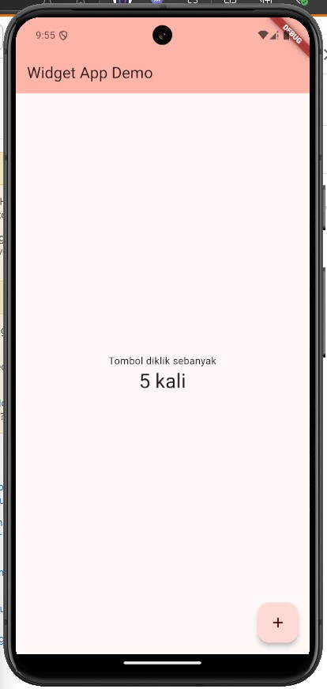
</p>

#### Menambahkan TextField

Saatnya eksperimen, saya akan menambahkan text field untuk menginput nama dan akan ditampilkan saat text diubah. <br>
Untuk membuat text field bisa menggunakan widget `TextField`. Saya juga membuat state baru untuk menyimpan data nama.

```dart
String _name = "";

void _setName(String value) {
  setState(() {
    _name = value;
  });
}
```

```dart
TextField(
  decoration: const InputDecoration(hintText: "Masukkan nama..."),
  onChanged: (value) {
    _setName(value);
  },
),
```

`onChanged` akan dijalankan saat ada perubahan huruf di TextField. perlu diperhatikan saat deklarasi widget yang dapat berubah tidak menggunakan const. Sebelumnya saya mendapat error tidak bisa menggunakan `onChanged`.

<p align="center">
  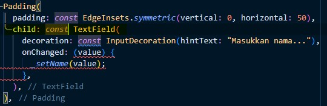
</p>

TextField saya masukkan ke dalam widget Padding untuk memberikan jarak horizontal.

```dart
<Widget>[
  Padding(
    padding: const EdgeInsets.symmetric(vertical: 0, horizontal: 50),
    child: TextField(
      decoration: const InputDecoration(hintText: "Masukkan nama..."),
      onChanged: (value) {
        _setName(value);
      },
    ),
  ),
  Text(
    '$_name mengklik sebanyak',
  ),
  Text(
    '$_counter kali',
    style: Theme.of(context).textTheme.headlineMedium,
  ),
],
```

<p align="center">
  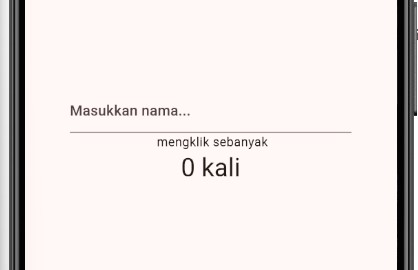
</p>

<p align="center">
  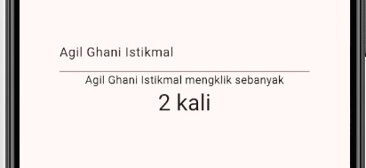
</p>

### Referensi

https://api.flutter.dev/flutter/widgets/widgets-library.html

---

# Pertemuan 3 

3 Oktober 2024 <br>
_Note: Kode lengkap aplikasi ini ada di folder github "widget_app"_

### Data Diri

| Nama                | NPM        |
| ------------------- | ---------- |
| Agil Ghani Istikmal | 5220411040 |

### Flutter Widget Lanjutan

Melanjutkan dari Flutter Widget Pertemuan-2 sebelumnya, disini saya akan mencoba eksplor lebih dalam tentang widget di flutter. <br>
Pada pertemuan ke-3 ini saya fokus untuk belajar melakukan styling dan layouting menggunakan Flutter. Saya membuat form sederhana untuk menampilkan data yang telah diinput. <br>

#### Struktur File

Agar lebih rapi, file dari setiap screen/page akan dipisahkan. Masing masing akan diletakkan dalam folder `lib/screen`. <br>

<p align="middle">
  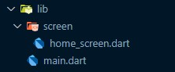
</p>

Karena menggunakan file file yang berbeda, maka ada sedikit perubahan di file `main.dart`. <br>

```dart
import 'package:flutter/material.dart';
import 'package:widget_app/screen/home_screen.dart'; // Import home screen dari file lain

void main() {
  runApp(const MyApp());
}

// Stateless artinya tidak ada perubahan yang dinamis alias statis
// Tidak memerlukan state yang value nya bisa berubah-ubah
class MyApp extends StatelessWidget {
  const MyApp({super.key});

  // build adalah root atau jalur utama dari aplikasi kita
  @override
  Widget build(BuildContext context) {
    return MaterialApp(
        title: 'Widget App Demo',
        theme: ThemeData(
          // Ini adalah tema basic untuk tampilan aplikasi kita
          // Contohnya kita bisa mengubah tema warna dibawah ini menjadi merah
          colorScheme: ColorScheme.fromSeed(seedColor: Colors.red),
          useMaterial3: true,
        ),
        // Untuk menghilangkan banner debug di kanan atas
        debugShowCheckedModeBanner: false,
        // Import HomeScreen dari file yang berbeda
        home: const HomeScreen());
  }
}
```

Pada file `home_screen.dart` hanya berisi tampilan untuk di di halaman atau screen Home saja.

```dart
class HomeScreen extends StatefulWidget {
  const HomeScreen({super.key});

  @override
  State<StatefulWidget> createState() => _HomeScreenState();
}

class _HomeScreenState extends State<HomeScreen> {
  @override
  Widget build(BuildContext context) {
    return ...
  }
}
```

#### Customize AppBar

Membuat tampilan AppBar dengan Text ditengah dengan latar belakang indigo.

```dart
Scaffold(
  appBar: AppBar(
    // Center digunakan agar text tampil di posisi tengah
    title: const Center(
      child: Text("Widget App Part 2"),
    ),
    backgroundColor: Colors.indigo,
    // Foreground disini adalah warna untuk Text
    foregroundColor: Colors.white,
  ),
  body: ...
)
```

<p align="middle">
  
</p>

#### Form Title

```dart
Padding(
  // Padding menggunakan symmetric agar bisa mengatur horizontal dan vertical yang berbeda.
  padding: const EdgeInsets.symmetric(horizontal: 24, vertical: 8),
  // Container digunakan agar dapat memberi kesan kotak dan bisa diberi warna.
  child: Container(
    // MediaQuery width ini bisa diartikan sebagai Full width
    width: MediaQuery.sizeOf(context).width,
    // Alignment center agar konten didalam container ini di tengah
    alignment: Alignment.center,
    // BoxDecoration untuk memberikan border radius, warna, dan styling lainnya
    decoration: BoxDecoration(
        // circular artinya disemua sisi memiliki radius yang sama
        borderRadius: BorderRadius.circular(8),
        color: Colors.indigo.shade50),
    child: const Padding(
      padding: EdgeInsets.symmetric(horizontal: 24, vertical: 8),
      child: Text(
        "Masukkan Identitas Anda",
        style: TextStyle(
            fontSize: 18,
            color: Colors.indigo,
            fontWeight: FontWeight.w500),
      ),
    ),
  ),
),
```

<p align="middle">
  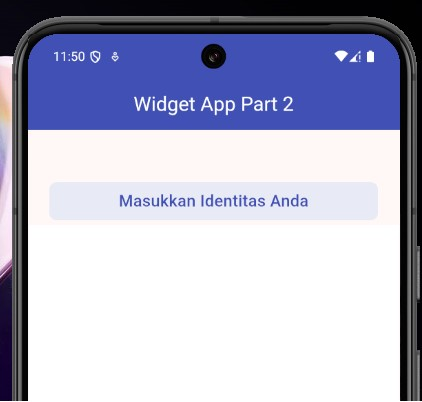
</p>

#### Form Body

Terdapat 2 input text, yaitu Nama dan NPM menggunakan widget `TextField`.

```dart
Padding(
  padding: const EdgeInsets.symmetric(horizontal: 24),
  child: Container(
    width: MediaQuery.sizeOf(context).width,
    decoration: BoxDecoration(
      borderRadius: BorderRadius.circular(8),
      color: Colors.grey.shade200,
    ),
    child: const Padding(
        padding: EdgeInsets.symmetric(horizontal: 12),
        child: TextField(
          // Untuk styling TextField menggunakan InputDecoration
          decoration: InputDecoration(
            // LabelText adalah judul dari inputan
            labelText: "Nama",
            // HintText adalah placeholder/bantuan pengisian data
            hintText: "Masukkan nama...",
            // Disini saya menghilangkan border agar lebih simple
            border: UnderlineInputBorder(
              borderSide: BorderSide.none,
            ),
          ),
        )),
  ),
),
```

<p align="middle">
  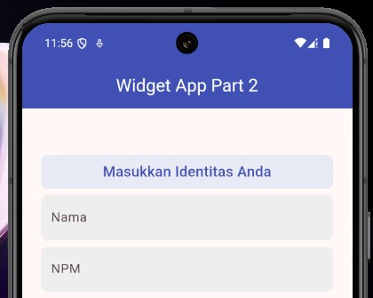
</p>

<p align="middle">
  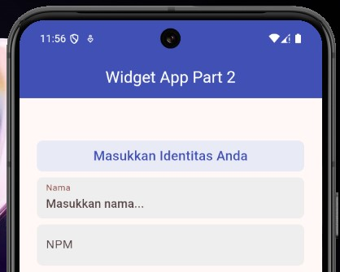
</p>

<p align="middle">
  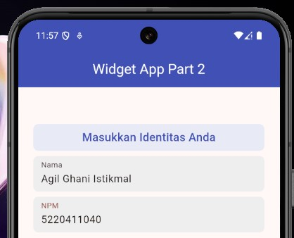
</p>

#### Button

Untuk membuat button di flutter bisa menggunakan widget `TextButton`. Namun saya bungkus menggunakan `Padding` dan `Container` agar tampilan lebih rapi dan menarik.

```dart
Padding(
  padding: const EdgeInsets.symmetric(horizontal: 24),
  child: Container(
    width: MediaQuery.sizeOf(context).width,
    decoration: BoxDecoration(
      borderRadius: BorderRadius.circular(8),
      // Disini saya memberi warna tombol menjadi indigo
      color: Colors.indigo,
    ),
    child: TextButton(
      // Saat Tombol di klik, maka akan mengubah state dan menampilkan datanya di section bawah ini.
      onPressed: () => {},
      // Menggunakan row agar icon dan text tampil secara horizontal
      child: const Row(
        // Main axis alignment center berarti semua konten didalam row akan berada di tengah
        mainAxisAlignment: MainAxisAlignment.center,
        children: [
          // Widget Icon untuk menampilkan Icon yang sudah ada di Flutter
          Icon(
            Icons.send_rounded,
            color: Colors.white,
          ),
          SizedBox(width: 8),
          Text(
            "Next",
            style: TextStyle(color: Colors.white),
          ),
        ],
      ),
    ),
  ),
),
```

<p align="middle">
  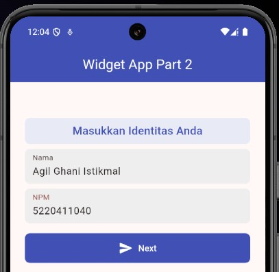
</p>

### ListView Widget

Selanjutnya saya akan mengimplementasikan form dan button sebelumnya untuk menampilkan data di list menggunakan ListView. <br>

ListView seperti column, widget tampil dari atas ke bawah secara vertical, namun dapat discroll sesuai dengan ukuran yang kita tentukan.

#### ListView Builder

```dart
ListView.builder(
  itemCount: 1,
  itemBuilder: (context, index) {
    return Container(
      color: Colors.grey.shade300,
      child: const Padding(
        padding: EdgeInsets.symmetric(horizontal: 24, vertical: 8),
        child: Column(
          children: [Text("NPM"), Text("Nama")],
        ),
      ),
    );
  },
)
```

Namun terdapat error seperti berikut.

<p align="middle">
  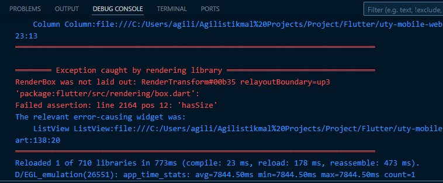
</p>

Setelah diselidiki, ternyata `ListView` tidak bisa langsung didalam child `Column`, harus di wrap menggunakan widget `Expanded` terlebih dahulu. Jadi seperti berikut

```dart
Expanded(
  child: ListView.builder(
    padding: const EdgeInsets.symmetric(horizontal: 24),
    // itemCount adalah jumlah dari item yang akan dibuat, disini menggunakan length dari list agar dinamis
    itemCount: dataList.length,
    // itemBuilder adalah widget yang akan dibuat untuk setiap perulangan sesuai jumlah itemCount
    itemBuilder: (context, index) {
      // Mengambil data dari list sesuai index
      final data = dataList[index];
      return Padding(
        padding: const EdgeInsets.symmetric(vertical: 4),
        child: Container(
          decoration: BoxDecoration(
            borderRadius: BorderRadius.circular(8),
            color: Colors.indigo.shade50,
          ),
          child: Padding(
            padding: const EdgeInsets.symmetric(
                horizontal: 24, vertical: 8),
            child: Column(
              crossAxisAlignment: CrossAxisAlignment.start,
              children: [
                Text(
                  data.npm!,
                  style: const TextStyle(
                    fontWeight: FontWeight.bold,
                    color: Colors.indigo,
                    fontSize: 18,
                  ),
                ),
                Text(
                  data.name!,
                  style: const TextStyle(
                    fontSize: 20,
                    fontWeight: FontWeight.w500,
                  ),
                ),
              ],
            ),
          ),
        ),
      );
    },
  ),
),
```

#### Implementasi Button

Sebelumnya button belum diimplementasikan. Sekarang akan mengimplementasikan button agar setiap button diklik, maka data yang dimasukkan akan disimpan kedalam list agar bisa ditampilkan.

```dart
// Sebagai control dan untuk mengambil nilai TextField
final npmController = TextEditingController();
final nameController = TextEditingController();

// Menyimpan list data
List<Data> dataList = [];

// Untuk menambahkan data ke list
void addToDataList(String npm, String name) {
  setState(() {
    dataList.add(Data(npm: npm, name: name));
  });
}

// Untuk membersihkan TextField saat state dimuat baru
@override
void dispose() {
  npmController.dispose();
  nameController.dispose();
  super.dispose();
}
```

```dart
TextButton(
  // Saat Tombol di klik, maka akan mengubah state dan menampilkan datanya di section bawah ini.
  onPressed: () => {
    // Menambahkan data ke list
    addToDataList(npmController.text, nameController.text),
    // Menghapus value npm dan nama dari textfield
    npmController.clear(),
    nameController.clear()
  },
  // Menggunakan row agar icon dan text tampil secara horizontal
  child: const Row(
    // Main axis alignment center berarti semua konten didalam row akan berada di tengah
    mainAxisAlignment: MainAxisAlignment.center,
    children: [
      // Widget Icon untuk menampilkan Icon yang sudah ada di Flutter
      Icon(
        Icons.send_rounded,
        color: Colors.white,
      ),
      SizedBox(width: 8),
      Text(
        "Next",
        style: TextStyle(color: Colors.white),
      ),
    ],
  ),
),
```

#### Uji Coba Input Data

<p align="center">
  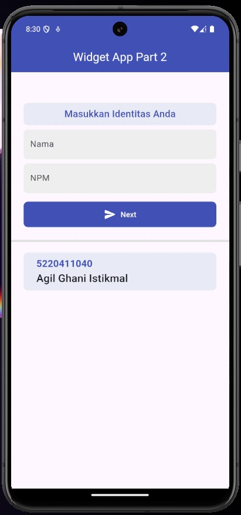
</p>

<p align="center">
  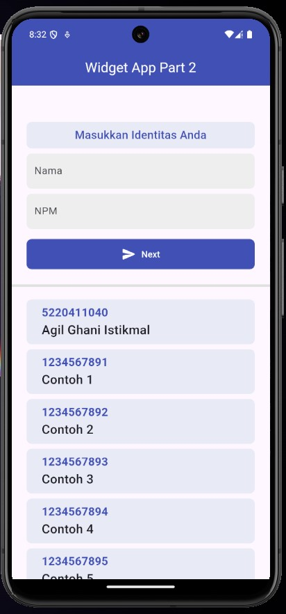
</p>

<p align="center">
  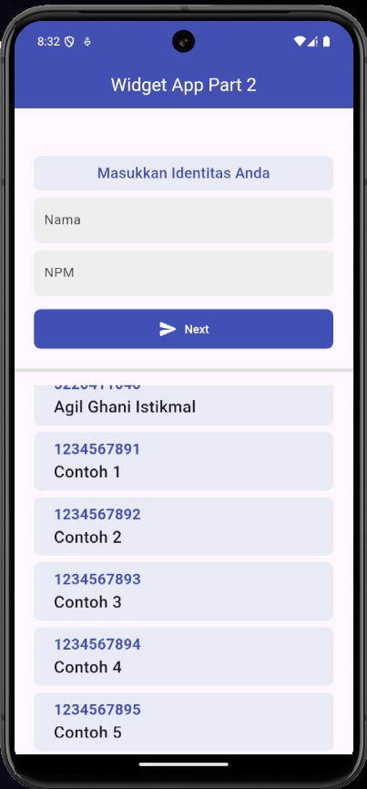
</p>

### Navigation

Flutter tentu saja bisa melakukan navigasi dari screen satu ke screen lainnya. <br>

#### Membuat Screen Baru

Saya membuat file atau screen baru bernama `another_screen.dart` didalam folder `screen`.

```dart
import 'package:flutter/material.dart';

class AnotherScreen extends StatefulWidget {
  const AnotherScreen({super.key});

  @override
  State<StatefulWidget> createState() => _AnotherScreenState();
}

class _AnotherScreenState extends State<AnotherScreen> {
  @override
  Widget build(BuildContext context) {
    return Scaffold(
      appBar: AppBar(
        title: const Text("Another Screen"),
        backgroundColor: Colors.indigo,
        foregroundColor: Colors.white,
      ),
    );
  }
}
```

Sama seperti Home Screen, namun dibedakan appbar nya agar membedakan.

#### Implementasi Button Navigasi

Pada home screen, saya menambahkan tombol untuk navigasi ke halaman lain.

```dart
Padding(
  padding: const EdgeInsets.symmetric(horizontal: 24),
  child: Container(
    width: MediaQuery.sizeOf(context).width,
    decoration: BoxDecoration(
      borderRadius: BorderRadius.circular(8),
      // Disini saya memberi warna tombol menjadi indigo dengan shade 50
      color: Colors.indigo.shade50,
    ),
    child: TextButton(
      // Saat Tombol di klik, maka akan pindah ke halaman AnotherScreen
      onPressed: () => {
        Navigator.of(context).push(MaterialPageRoute(
          builder: (context) => const AnotherScreen(),
        ))
      },
      // Menggunakan row agar icon dan text tampil secara horizontal
      child: const Row(
        // Main axis alignment center berarti semua konten didalam row akan berada di tengah
        mainAxisAlignment: MainAxisAlignment.center,
        children: [
          // Widget Icon untuk menampilkan Icon yang sudah ada di Flutter
          Icon(
            Icons.navigate_next,
            color: Colors.indigo,
          ),
          SizedBox(width: 8),
          Text(
            "Go to another page",
            style: TextStyle(color: Colors.indigo),
          ),
        ],
      ),
    ),
  ),
),
```

<p align="center">
  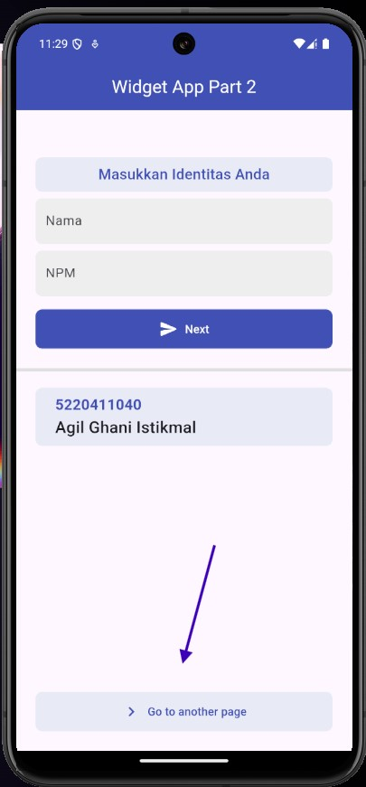
</p>

<p align="center">
  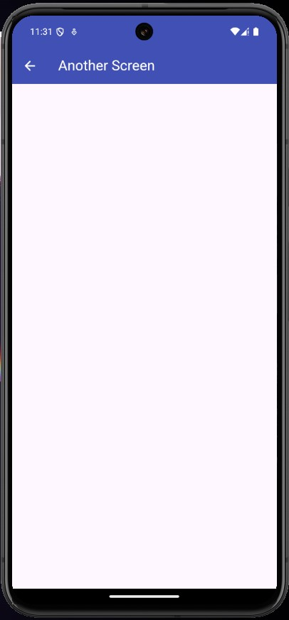
</p>

### GridView

GridView pada dart berguna untuk layouting, grid menentukan jumlah item secara horizontal dibagi dengan 3 misalnya. Maka dalam 1 baris horizontal hanya akan terdapat 3 item, dan sisanya akan diletakkan dibawah.

```dart
GridView(
  gridDelegate: const SliverGridDelegateWithFixedCrossAxisCount(
    // Menentukan maksimal 1 garis horizontal ada berapa item
    crossAxisCount: 3,
  ),
  children: [
    Container(
      color: Colors.red,
      alignment: Alignment.center,
      child: const Text(
        "Child 1",
        style: TextStyle(color: Colors.white, fontSize: 24),
      ),
    ),
    Container(
      color: Colors.yellow,
      alignment: Alignment.center,
      child: const Text(
        "Child 2",
        style: TextStyle(color: Colors.white, fontSize: 24),
      ),
    ),
    Container(
      color: Colors.green,
      alignment: Alignment.center,
      child: const Text(
        "Child 3",
        style: TextStyle(color: Colors.white, fontSize: 24),
      ),
    ),
    Container(
      color: Colors.blue,
      alignment: Alignment.center,
      child: const Text(
        "Child 4",
        style: TextStyle(color: Colors.white, fontSize: 24),
      ),
    )
  ],
),
```

<p align="center">
  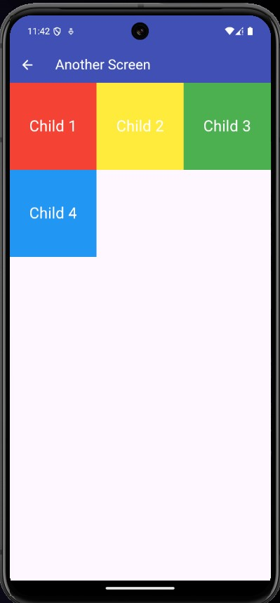
</p>

### Referensi

https://api.flutter.dev/flutter/widgets/widgets-library.html <br>
https://medium.com/@marketing_96275/how-to-create-and-design-buttons-in-flutter-81e87f709348

---

# Pertemuan 4 

10 Oktober 2024 <br>
_Note: Kode lengkap aplikasi ini ada di folder github "widget_app"_

### Data Diri

| Nama                | NPM        |
| ------------------- | ---------- |
| Agil Ghani Istikmal | 5220411040 |

### Form Login dan Navigasi

Pada pertemuan 4 mencoba slicing UI untuk membuat form login dan navigasi ke halaman selanjutnya setelah login.

#### Struktur

Karena akan melakukan navigasi antar screen, maka saya memisahkan setiap screen di masing-masing file.

<p align="center">
  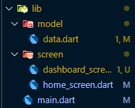
</p>

`home_screen.dart` adalah halaman Login, dan `dashboard_screen.dart` adalah halaman dashboard setelah login.

`model/data.dart` merupakan class untuk menyimpan data login

```dart
import 'dart:ffi';

class Data {
  String? image;
  String? name;
  String? price;

  Data({this.image, this.name, this.price});
}
```

#### Halaman Form Login

##### Controller

Pertama membuat controller untuk menyimpan data input user agar bisa dicek dan dikirim ke screen lainnya.

```dart
class _HomeScreenState extends State<HomeScreen> {
  // Sebagai control dan untuk mengambil nilai TextField
  final usernameController = TextEditingController();
  final passwordController = TextEditingController();

  // Untuk membersihkan TextField saat state dimuat baru
  @override
  void dispose() {
    usernameController.dispose();
    passwordController.dispose();
    super.dispose();
  }

  ...
}
```

##### AppBar

Appbar sederhana dengan text Welcome ditengah

```dart
AppBar(
  // Center digunakan agar text tampil di posisi tengah
  title: const Center(
    child: Text("Welcome"),
  ),
  backgroundColor: Colors.indigo,
  // Foreground disini adalah warna untuk Text
  foregroundColor: Colors.white,
),
```

<p align="center">
  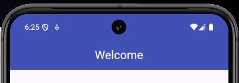
</p>

##### Image

Menambahkan Image dari local image menggunakan `Image` dan `AssetImage`

```dart
Image(
  image: AssetImage("assets/logo.png"),
  height: 250,
),
```

<p align="center">
  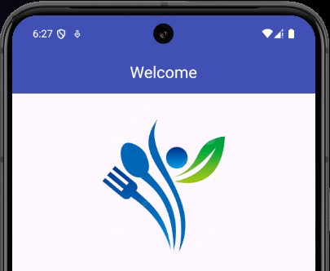
</p>

##### TextField

Menambahkan TextField untuk Username dan Password. TextField ini terhubung ke controller yang sudah dibuat sebelumnya.

```dart
Padding(
  padding: const EdgeInsets.symmetric(horizontal: 24),
  child: Container(
    width: MediaQuery.sizeOf(context).width,
    decoration: BoxDecoration(
      borderRadius: BorderRadius.circular(8),
      color: Colors.grey.shade200,
    ),
    child: Padding(
        padding: const EdgeInsets.symmetric(horizontal: 12),
        child: TextField(
          // Untuk styling TextField menggunakan InputDecoration
          decoration: const InputDecoration(
            // LabelText adalah judul dari inputan
            labelText: "Username",
            // HintText adalah placeholder/bantuan pengisian data
            hintText: "Masukkan username...",
            // Disini saya menghilangkan border agar lebih simple
            border: UnderlineInputBorder(
              borderSide: BorderSide.none,
            ),
          ),
          // Menghubungkan ke controller
          controller: usernameController,
        )),
  ),
),
const SizedBox(height: 8),
Padding(
  padding: const EdgeInsets.symmetric(horizontal: 24),
  child: Container(
    width: MediaQuery.sizeOf(context).width,
    decoration: BoxDecoration(
      borderRadius: BorderRadius.circular(8),
      color: Colors.grey.shade200,
    ),
    child: Padding(
        padding: const EdgeInsets.symmetric(horizontal: 12),
        child: TextField(
          obscureText: true,
          decoration: const InputDecoration(
            labelText: "Password",
            hintText: "Masukkan P@ssw0rd...",
            border: UnderlineInputBorder(
              borderSide: BorderSide.none,
            ),
          ),
          controller: passwordController,
        )),
  ),
),
```

<p align="center">
  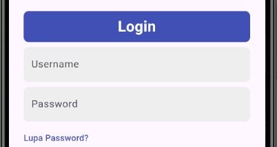
</p>

##### Button

Membuat Button yang saat diklik sekaligus mengirim data user ke DashboardScreen

```dart
Padding(
  padding: const EdgeInsets.symmetric(horizontal: 24),
  child: Container(
    width: MediaQuery.sizeOf(context).width,
    decoration: BoxDecoration(
      borderRadius: BorderRadius.circular(8),
      // Disini saya memberi warna tombol menjadi indigo
      color: Colors.indigo,
    ),
    child: TextButton(
      // Saat Tombol di klik, maka akan mengirim datanya ke DashboardScreen
      onPressed: () => {
        Navigator.of(context).push(
          MaterialPageRoute(
            builder: (context) => DashboardScreen(
              username: usernameController,
              password: passwordController,
            ),
          ),
        )
      },
      // Menggunakan row agar icon dan text tampil secara horizontal
      child: const Row(
        // Main axis alignment center berarti semua konten didalam row akan berada di tengah
        mainAxisAlignment: MainAxisAlignment.center,
        children: [
          // Widget Icon untuk menampilkan Icon yang sudah ada di Flutter
          Icon(
            Icons.send_rounded,
            color: Colors.white,
          ),
          SizedBox(width: 8),
          Text(
            "Login",
            style: TextStyle(color: Colors.white),
          ),
        ],
      ),
    ),
  ),
),
```

<p align="center">
  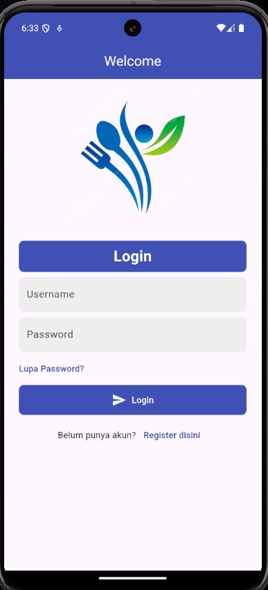
</p>

#### Halaman Dashboard

##### Mengambil Data

```dart
import 'dart:ffi';

import 'package:flutter/material.dart';
import 'package:widget_app/model/data.dart';

class DashboardScreen extends StatefulWidget {
  // Menyiapkan variable untuk menampung data
  final TextEditingController username;
  final TextEditingController password;

  const DashboardScreen({
    super.key,
    required this.username,
    required this.password,
  });

  @override
  State<StatefulWidget> createState() =>
      // Meneruskan data ke Screen State
      // ignore: no_logic_in_create_state
      _DashboardScreenState(username: username, password: password);
}
```

#### Dummy Data

```dart
class _DashboardScreenState extends State<DashboardScreen> {
  _DashboardScreenState({required this.username, required this.password});

  // Menyiapkan variable untuk menampung data
  final TextEditingController username;
  final TextEditingController password;

  // Membuat data dummy untuk ditampilkan
  final List<Data> datalist = [
    Data(image: "makan1.jpg", name: "Mie Ayam Bakso", price: "15.000"),
    Data(image: "makan2.jpeg", name: "Nasi Goreng", price: "25.000"),
    Data(image: "makan3.jpg", name: "Sate Ayam", price: "20.000"),
  ];

  ...
}
```

##### AppBar

Appbar otomatis memiliki navigasi back ke halaman sebelumnya.

```dart
AppBar(
  title: const Text("Dashboard"),
  backgroundColor: Colors.indigo,
  foregroundColor: Colors.white,
),
```

<p align="center">
  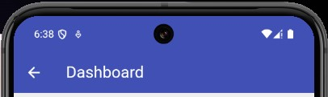
</p>

##### Text Sambutan

Menambah gambar profil dan username di bagian atas.

```dart
Container(
  color: Colors.grey.shade200,
  child: Padding(
    padding: const EdgeInsets.symmetric(horizontal: 24, vertical: 8),
    child: Row(
      children: [
        // Menambahkan gambar profil dibagian kiri
        const Image(
          image: AssetImage("assets/profile.png"),
          width: 50,
        ),
        // Untuk jarak dari gambar ke text
        const SizedBox(
          width: 16,
        ),
        // Menambahkan column agar text bisa atas bawah
        Column(
          crossAxisAlignment: CrossAxisAlignment.start,
          children: [
            const Text(
              "Halo, selamat pagi",
              style: TextStyle(fontSize: 18),
            ),
            // Mengambil data username
            Text(
              username.text,
              style: const TextStyle(
                  fontSize: 20, fontWeight: FontWeight.w500),
            )
          ],
        ),
      ],
    ),
  ),
),
```

<p align="center">
  
</p>

##### Banner

Menambah Banner dan menggunakan `ClipRRect` agar ada lekukan disudut gambar

```dart
Padding(
  padding: const EdgeInsets.symmetric(horizontal: 12, vertical: 8),
  child: ClipRRect(
    // Agar gambar ada lekukan diujung
    borderRadius: BorderRadius.circular(12),
    child: Image(
        image: const AssetImage("assets/sushi.jpg"),
        // Agar gambar membesar ke ukuran ClipRREct
        fit: BoxFit.cover,
        height: 150,
        // Membuat gambar lebarnya full
        width: MediaQuery.sizeOf(context).width),
  ),
),
```

<p align="center">
  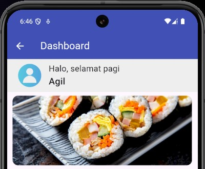
</p>

##### ListView

Menampilkan seluruh daftar makanan.

```dart
Expanded(
  child: ListView.builder(
    // Mengambil jumlah data
    itemCount: datalist.length,
    itemBuilder: (context, index) {
      return Padding(
        // Memberikan padding
        padding: const EdgeInsets.symmetric(
          horizontal: 12,
          vertical: 8,
        ),
        child: Container(
          color: Colors.grey.shade200,
          child: Padding(
            padding: const EdgeInsets.symmetric(
                horizontal: 12, vertical: 8),
            child: Row(
              children: [
                ClipRRect(
                  // Agar sudut tidak lancip
                  borderRadius: BorderRadius.circular(12),
                  child: Image(
                    // Mengambil gambar sesuai setiap menu
                    image:
                        AssetImage("assets/${datalist[index].image}"),
                    width: 100,
                    height: 100,
                    fit: BoxFit.cover,
                  ),
                ),
                const SizedBox(
                  width: 24,
                ),
                Column(
                  // Agar text rata kiri
                  crossAxisAlignment: CrossAxisAlignment.start,
                  children: [
                    // Mengambil nama sesuai menu
                    Text(
                      "${datalist[index].name}",
                      style: const TextStyle(
                          fontWeight: FontWeight.w500, fontSize: 18),
                    ),
                    // Mengambil harga sesuai menu
                    Text("Rp${datalist[index].price}")
                  ],
                ),
              ],
            ),
          ),
        ),
      );
    },
  ),
),
```

<p align="center">
  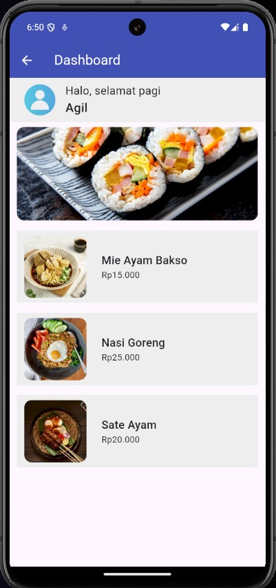
</p>

### Referensi

https://api.flutter.dev/flutter/widgets/widgets-library.html <br>
https://stackoverflow.com/questions/51513429/how-to-do-rounded-corners-image-in-flutter <br>
https://stackoverflow.com/questions/50287995/passing-data-to-statefulwidget-and-accessing-it-in-its-state-in-flutter

---

# Pertemuan 5 
## Data diri

| Nama                | NPM        |
| ------------------- | ---------- |
| Agil Ghani Istikmal | 5220411040 |

---

## Design Figma

Figma adalah salah satu aplikasi yang dapat digunakan untuk membuat design mobile. Figma dapat diakses melalui website [figma.com](https://figma.com) maupun aplikasi desktop.

<p align="center">
  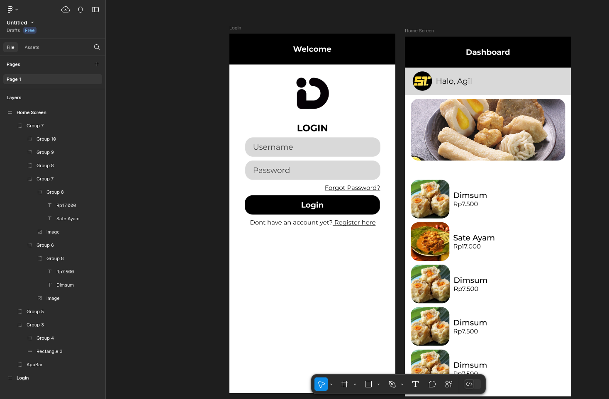
<p>

<p align="center">
  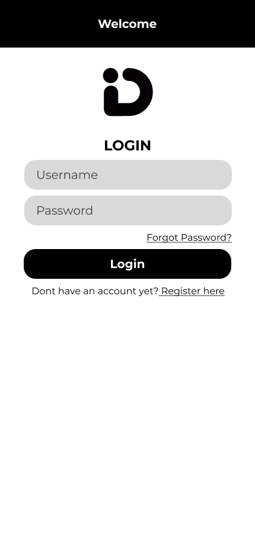
  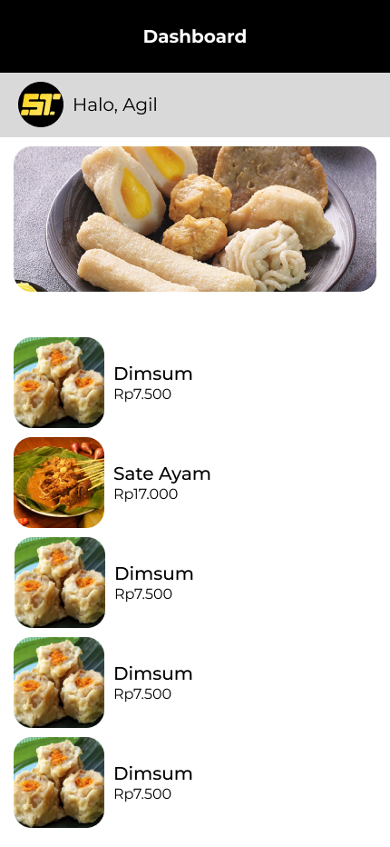
<p>

## REST API

REST API atau RESTful API yang memiliki kepanjangan **RE**presentational **S**tate **T**ransfer adalah salah satu cara berkomunikasi antar client-server menggunakan protokol HTTP. <br>

Gambaran sederhananya, client mengirim request ke endpoint tertentu, dan dikembalikan response nya saat request telah selesai diproses. <br>

REST menggunakan JSON untuk request body dan response body nya.

<p align="center">
  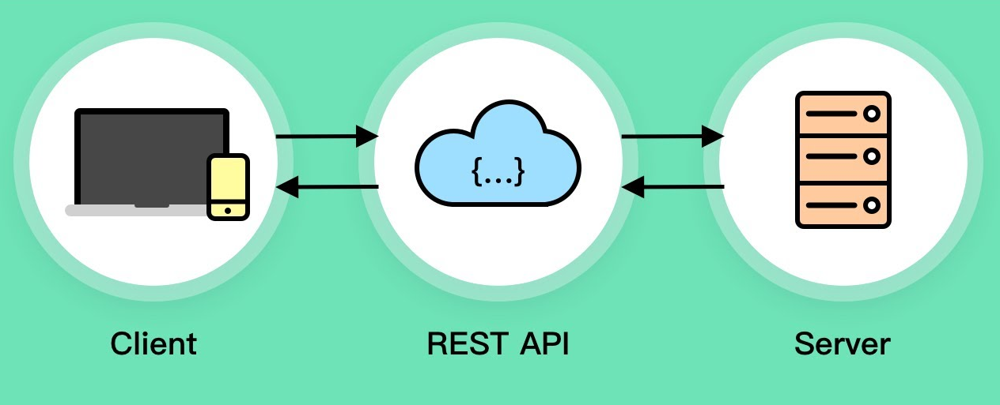
<p>

### HTTP Methods

Karena REST API menggunakan protokol HTTP, maka ada beberapa protokol HTTP yang sering digunakan untuk membuat RESTful API.

#### GET

Method GET biasanya digunakan untuk menampilkan daftar data atau detail tentang data tersebut.

##### GET /user

Contohnya dengan endpoint GET `http://localhost:3000/user`
Ini digunakan untuk mengambil daftar data user yang ada di database. <br>

Contoh Response:

```json
{
  "status": 200,
  "message": "ok",
  "data": [
    {
      "username": "agilistikmal",
      "full_name": "Agil Ghani Istikmal",
      "phone": "+6281346173829",
      "created_at": "...",
      "updated_at": "..."
    },
    {
      "username": "ghani",
      "full_name": "Ghani Istikmal Agil",
      "phone": "++628123456789",
      "created_at": "...",
      "updated_at": "..."
    },
  ]
}
```

##### GET /user/:username

Ini untuk menampilkan 1 data detail tentang user dengan username tersebut. Contohnya `GET /user/agilistikmal` <br>

Contoh Response:

```json
{
  "status": 200,
  "message": "ok",
  "data": {
    "username": "agilistikmal",
    "full_name": "Agil Ghani Istikmal",
    "phone": "+6281346173829",
    "created_at": "...",
    "updated_at": "..."
  }
}
```

#### POST

POST digunakan untuk membuat atau input data baru. POST menyertakan body berupa JSON. <br>

##### POST /user

```json
{
  "username": "agilistikmal",
  "full_name": "Agil Ghani Istikmal",
  "phone": "+6281346173829"
}
```

Contoh Response:

```json
{
  "status": 200,
  "message": "ok",
  "data": {
    "username": "agilistikmal",
    "full_name": "Agil Ghani Istikmal",
    "phone": "+6281346173829",
    "created_at": "...",
    "updated_at": "..."
  }
}
```

#### PUT

PUT digunakan untuk mengubah dengan menyertakan keseluruhan data baru. <br>

##### PUT /user/:username

Contohnya ingin mengubah data user agilistikmal `PUT /user/agilistikmal`

```json
{
  "username": "agil_baru",
  "full_name": "Agil Punya Nama Baru",
  "phone": "+62812345789"
}
```

Contoh Response:

```json
{
  "status": 200,
  "message": "ok",
  "data": {
    "username": "agil_baru",
    "full_name": "Agil Punya Nama Baru",
    "phone": "+62812345789",
    "created_at": "...",
    "updated_at": "..."
  }
}
```

#### PATCH

PATCH digunakan untuk mengubah sebagian data saja. <br>

##### PATCH /user/:username

Contohnya ingin mengubah data full_name pada user agilistikmal `PATCH /user/agil_baru`

```json
{
  "full_name": "Agil Saja",
}
```

Contoh Response:

```json
{
  "status": 200,
  "message": "ok",
  "data": {
    "username": "agil_baru",
    "full_name": "Agil saja",
    "phone": "+62812345789",
    "created_at": "...",
    "updated_at": "..."
  }
}
```

#### DELETE

Method DELETE digunakan untuk menghapus data

##### DELETE /user/:username

`DELETE /user/agil_baru` maka akan menghapus data user dengan username agil_baru

Contoh Response:

```json
{
  "status": 200,
  "message": "ok",
  "data": {
    "username": "agil_baru",
    "full_name": "Agil saja",
    "phone": "+62812345789",
    "created_at": "...",
    "updated_at": "..."
  }
}
```

## API User Login

Saya membuat API untuk user melakukan login menggunakan Golang. <br>

### Struktur Folder

Berikut adalah struktur folder untuk membuat REST API di Golang.

<p align="center">
  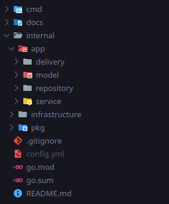
  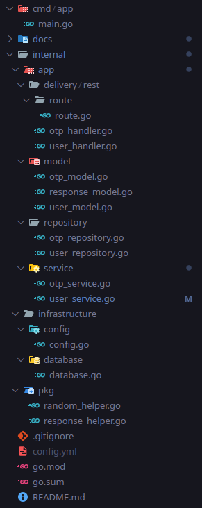
<p>

### Model

Mempersiapkan model untuk disimpan di database dan ditampilkan sebagai response. <br>

Saya menggunakan GORM sebagai ORM (Object Relational Mapping) untuk membuat tabel di database berdasarkan struct golang.

#### User Model
```go
package model

import "time"

type User struct {
	Username      string    `json:"username,omitempty" gorm:"primaryKey" validate:"required,min=3,max=20"`
	FullName      string    `json:"full_name,omitempty" validate:"required,min=3,max=50"`
	Phone         string    `json:"phone,omitempty" validate:"required,e164"`
	Password      string    `json:"password,omitempty" validate:"required,min=8"`
	PasswordRetry *int      `json:"password_retry,omitempty" gorm:"default:0"`
	CreatedAt     time.Time `json:"created_at,omitempty"`
	UpdatedAt     time.Time `json:"updated_at,omitempty"`
}
```

#### Response Model

Response model digunakan untuk menampilkan response dalam bentuk JSON kepada client.

```go
package model

type Response struct {
	Success bool   `json:"success,omitempty"`
	Code    int    `json:"code,omitempty"`
	Message string `json:"message,omitempty"`
	Data    any    `json:"data,omitempty"`
}

```

Contoh Response:

```json
{
  "success": true,
  "code": 200,
  "message": "ok",
  "data": {
    "username": "agilistikmal",
    ...
  }
}
```

### Repository

Folder repository berisi repository sebagai penghubung ke database.

```go
package repository

import (
	"github.com/agilistikmal/uty-mobile-web-service-api/internal/app/model"
	"gorm.io/gorm"
)

// Struct User Repository
type UserRepository struct {
	// Field db untuk mengakses database
	db *gorm.DB
}

// Constructor untuk membuat user repository
func NewUserRepository(db *gorm.DB) *UserRepository {
	return &UserRepository{
		db: db,
	}
}

// Untuk membuat user baru
func (r *UserRepository) Create(user *model.User) (*model.User, error) {
	// Argumen user akan dibuat ke database
	// lalu akan diperbarui datanya saat selesai dibuat
	err := r.db.Create(&user).Error
	if err != nil {
		return nil, err
	}

	return user, nil
}

// Untuk mencari user berdasarkan username
func (r *UserRepository) Find(username string) (*model.User, error) {
	// Membuat variable untuk menyimpan data user
	var user *model.User
	err := r.db.Take(&user, "username = ?", username).Error
	if err != nil {
		return nil, err
	}

	return user, nil
}

// Untuk mengupdate user
func (r *UserRepository) Update(username string, user *model.User) (*model.User, error) {
	err := r.db.Where("username = ?", username).Updates(&user).Error
	if err != nil {
		return nil, err
	}

	return user, nil
}

```

### Service

Service digunakan untuk business logic aplikasi. Contohnya untuk user service akan menangani logic untuk melakukan login, register, besereta validasi.

```go
package service

import (
	"fmt"

	"github.com/agilistikmal/uty-mobile-web-service-api/internal/app/model"
	"github.com/agilistikmal/uty-mobile-web-service-api/internal/app/repository"
	"github.com/go-playground/validator/v10"
	"golang.org/x/crypto/bcrypt"
)

type UserService struct {
	// Inject user repository untuk mengakses user
	userRepository *repository.UserRepository
	// Validate untuk melakukan validasi data
	validate *validator.Validate
}

func NewUserService(userRepository *repository.UserRepository, validate *validator.Validate) *UserService {
	return &UserService{
		userRepository: userRepository,
		validate:       validate,
	}
}

func (s *UserService) Register(user *model.User) (*model.User, error) {
	// Melakukan validasi data user
	// apakah sesuai dengan kontrak yang dibuat di model.
	err := s.validate.Struct(user)
	if err != nil {
		return nil, err
	}

	// Melakukan hashing password menggunakan bcrypt
	hashPassword, err := bcrypt.GenerateFromPassword([]byte(user.Password), 10)
	if err != nil {
		return nil, err
	}

	user.Password = string(hashPassword)
	user.Verified = false

	user, err = s.userRepository.Create(user)
	return user, err
}

func (s *UserService) Login(username string, password string) (*model.User, error) {
	// Mencari data user
	user, err := s.userRepository.Find(username)
	if err != nil {
		return nil, err
	}

	now := time.Now()
	difference := now.Sub(user.LockedAt)
	retrySeconds := 10

	if difference < time.Duration(retrySeconds)*time.Second {
		return nil, fmt.Errorf("account locked, please wait %ds", retrySeconds-int(difference.Seconds()))
	}

	err = bcrypt.CompareHashAndPassword([]byte(user.Password), []byte(password))
	if err != nil {
		// Untuk melakukan locking jika 3x password salah
		maxRetry := 3
		if *user.PasswordRetry < maxRetry {
			*user.PasswordRetry += 1
		} else {
			*user.PasswordRetry = 0
			user.LockedAt = time.Now()
		}
		_, err := s.userRepository.Update(user.Username, user)
		if err != nil {
			return nil, err
		}
		return nil, fmt.Errorf("invalid password (%d/3)", *user.PasswordRetry)
	}

	return user, nil
}

```

### Delivery REST API Handler

Berikutnya adalah menghandle request dari client dan meneruskan ke service lalu mengembalikan hasilnya dengan response.

#### user_handler.go

Pada file ini berisikan logic saat request diterima dan apa yang dilakukan setelah request diterima.

```go
package rest

import (
	"encoding/json"
	"net/http"

	"github.com/agilistikmal/uty-mobile-web-service-api/internal/app/model"
	"github.com/agilistikmal/uty-mobile-web-service-api/internal/app/service"
	"github.com/agilistikmal/uty-mobile-web-service-api/internal/pkg"
)

type UserHandler struct {
	service    *service.UserService
	otpService *service.OTPService
}

func NewUserHandler(service *service.UserService, otpService *service.OTPService) *UserHandler {
	return &UserHandler{
		service:    service,
		otpService: otpService,
	}
}

func (h *UserHandler) Register(w http.ResponseWriter, r *http.Request) {
	// Melakukan konversi request body JSON ke struct model user
	var user *model.User
	err := json.NewDecoder(r.Body).Decode(&user)
	if err != nil {
		pkg.SendError(w, http.StatusInternalServerError, err.Error())
		return
	}

	// Melakukan registrasi user
	user, err = h.service.Register(user)
	if err != nil {
		pkg.SendError(w, http.StatusBadRequest, err.Error())
		return
	}

	pkg.SendSuccess(w, user)
}

func (h *UserHandler) Login(w http.ResponseWriter, r *http.Request) {
	// Melakukan konversi request body JSON ke struct model user
	var user *model.User
	err := json.NewDecoder(r.Body).Decode(&user)
	if err != nil {
		pkg.SendError(w, http.StatusInternalServerError, err.Error())
		return
	}

	// Melakukan login
	user, err = h.service.Login(user.Username, user.Password)
	if err != nil {
		pkg.SendError(w, http.StatusBadRequest, err.Error())
		return
	}

	pkg.SendSuccess(w, user)
}

```

#### route.go

File ini untuk mendaftarkan routing dengan method dan endpoint tertentu.

```go
package route

import (
	"net/http"

	"github.com/agilistikmal/uty-mobile-web-service-api/internal/app/delivery/rest"
)

type Route struct {
	Mux *http.ServeMux

	UserHandler *rest.UserHandler
}

func NewRoutes(userHandler *rest.UserHandler, otpHandler *rest.OTPHandler) *Route {
	return &Route{
		Mux:         http.NewServeMux(),
		UserHandler: userHandler,
	}
}

func (r *Route) Init() {
	r.ProductRoutes()
}

func (r *Route) ProductRoutes() {
	// Mendaftarkan user handler dengan endpoint
	r.Mux.HandleFunc("POST /auth/register", r.UserHandler.Register)
	r.Mux.HandleFunc("POST /auth/login", r.UserHandler.Login)
}

```

### Main

Pada akhirnya, semuanya dijahit dalam file `main.go` untuk menjalankan keseluruhannya.

```go
package main

import (
	"log"
	"net/http"

	"github.com/agilistikmal/uty-mobile-web-service-api/internal/app/delivery/rest"
	"github.com/agilistikmal/uty-mobile-web-service-api/internal/app/delivery/rest/route"
	"github.com/agilistikmal/uty-mobile-web-service-api/internal/app/repository"
	"github.com/agilistikmal/uty-mobile-web-service-api/internal/app/service"
	"github.com/agilistikmal/uty-mobile-web-service-api/internal/infrastructure/config"
	"github.com/agilistikmal/uty-mobile-web-service-api/internal/infrastructure/database"
	"github.com/go-playground/validator/v10"
)

func main() {
        // Memuat configurasi config.yml
	config.NewConfig()

        // Inisialisasi database dan validator
	db := database.NewDatabase()
	validate := validator.New()

        // Inject repository dan service
	userRepository := repository.NewUserRepository(db)
	userService := service.NewUserService(userRepository, validate)

	// REST Handler
	userHandler := rest.NewUserHandler(userService, otpService)

	routes := route.NewRoutes(userHandler)
	routes.Init()

        // Menjalankan di port 8080
	log.Println("Running on http://localhost:8080")
	http.ListenAndServe(":8080", routes.Mux)
}

```

### Testing Postman

#### Register - Error Validation

Disini mencoba untuk validasi, berhasil terlihat bahwa password tidak memenuhi minimal 8 karakter.

<p align="center">
  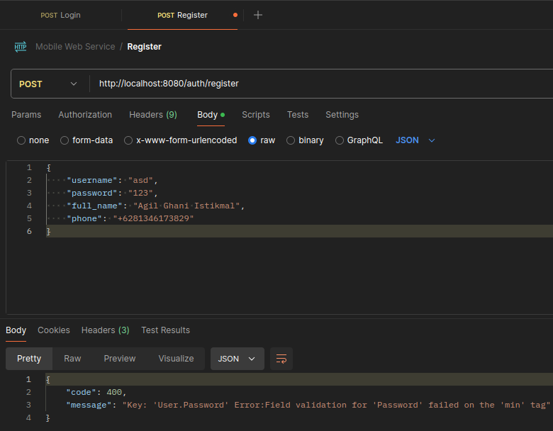
<p>

#### Register - Success

Setelah valid, maka akan berhasil melakukan registrasi seperti berikut.

<p align="center">
  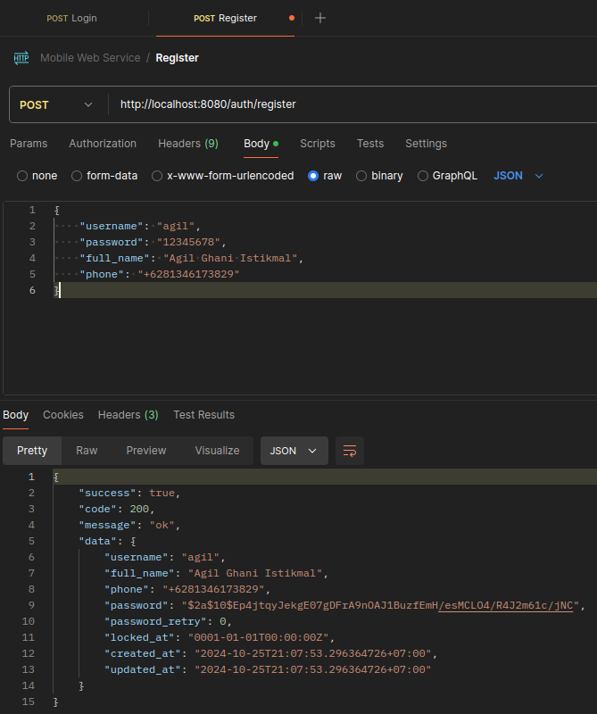
<p>

#### Login - Error Invalid Password

Terdapat pesan peringatan saat password salah. Setelah 3x maka akun akan di lock selama 30 detik.

<p align="center">
  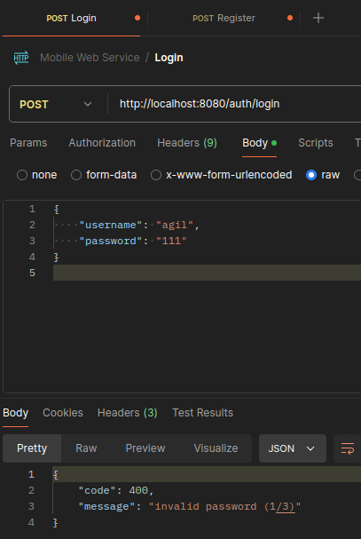
<p>

#### Login - Success

<p align="center">
  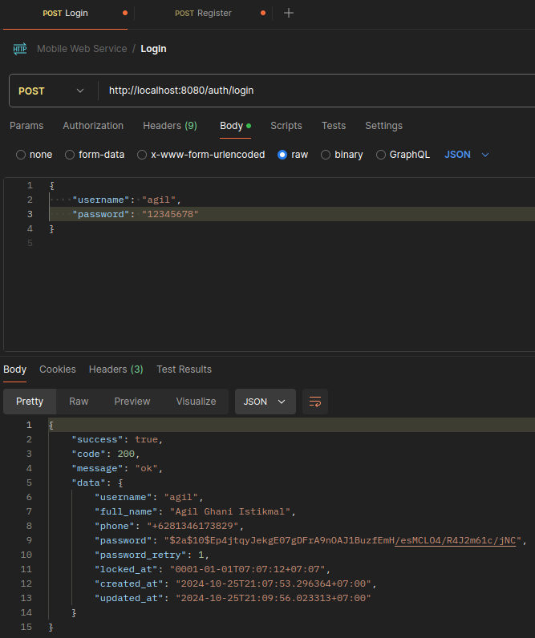
<p>

---

# Pertemuan 6 

Kode full untuk API (Go) ada di repository ini. <br>
Kode full untuk Flutter cek di https://github.com/agilistikmal/idcardku

## Data diri

| Nama                | NPM        |
| ------------------- | ---------- |
| Agil Ghani Istikmal | 5220411040 |

---

## Konversi Figma ke Flutter

Sebelumnya saya merubah desain figma dari warna hitam menjadi hijau, dan menambahkan beberapa halaman baru seperti berikut.

<p align="center">
	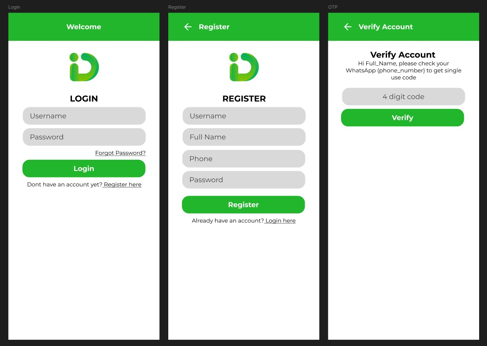
</p>

<p align="center">
	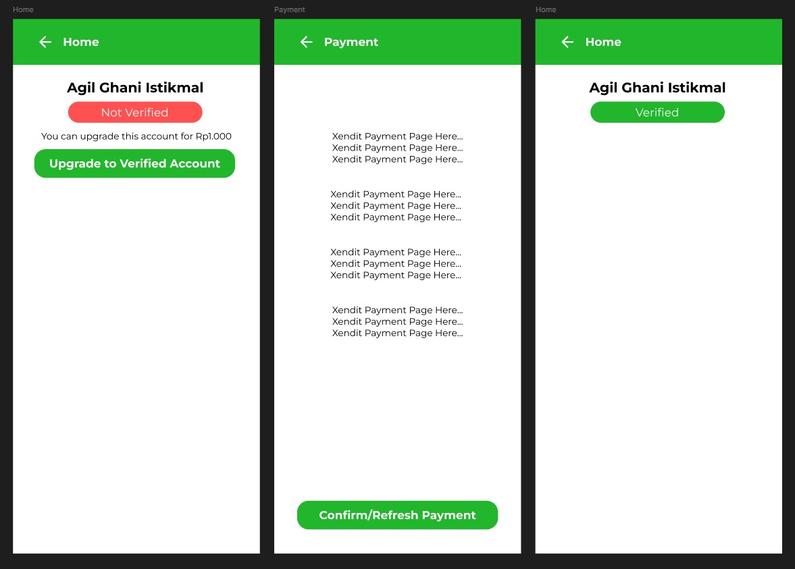
</p>

Untuk membantu konversi ke flutter, bisa melihat dari property desain di figma. <br>
Ini membantu untuk mengetahui warna, ukuran, padding, font size, font type, dan lain lain.

<p align="center">
	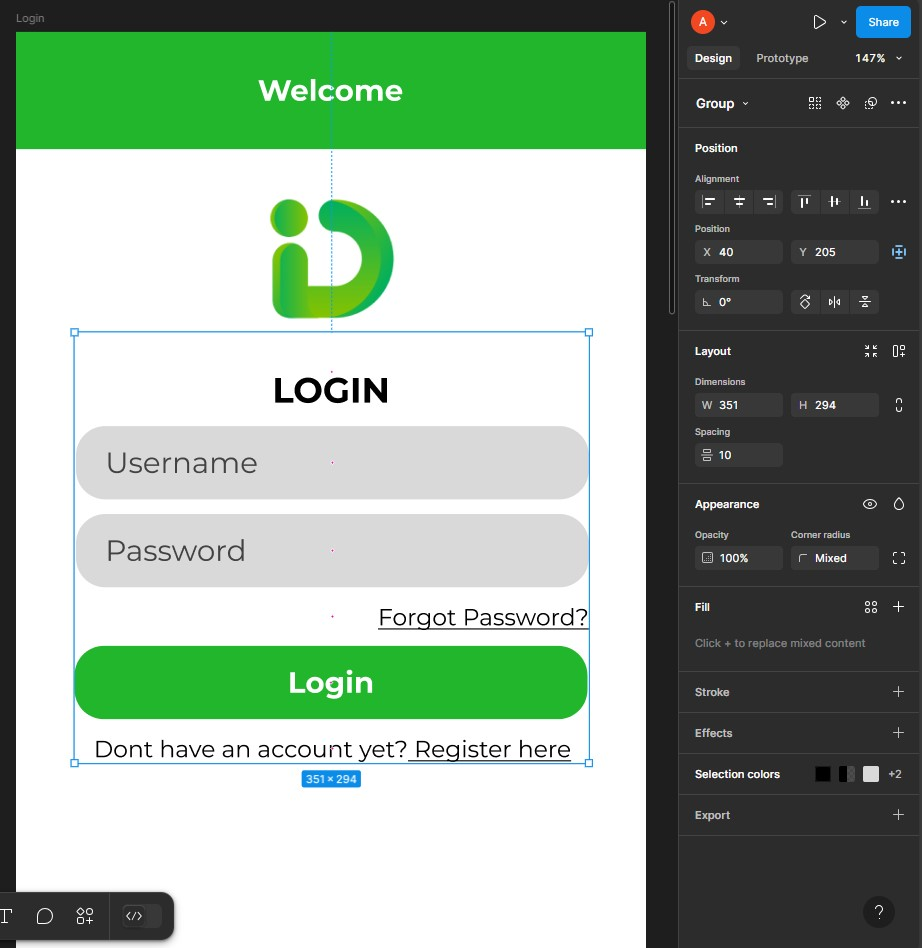
</p>

Sehingga hasil akhir nya seperti berikut ini.

### Login & Register

<p align="center">
	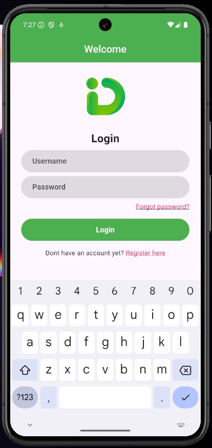
	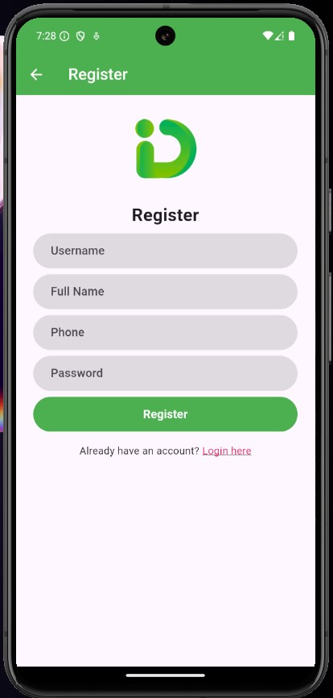
</p>

### OTP & Home

<p align="center">
	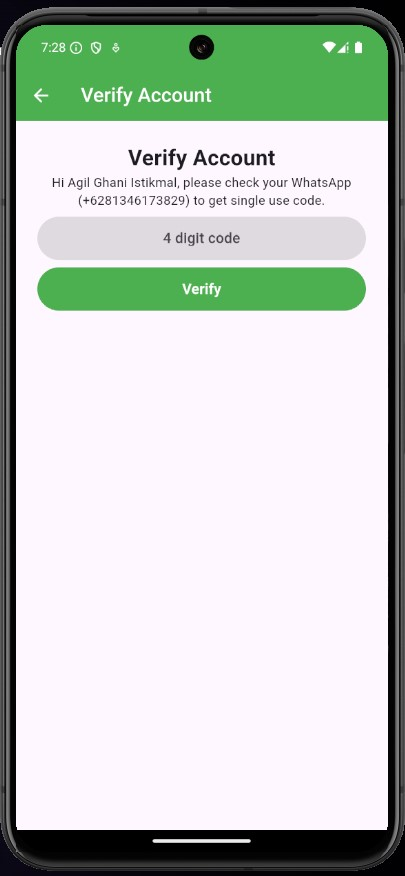
	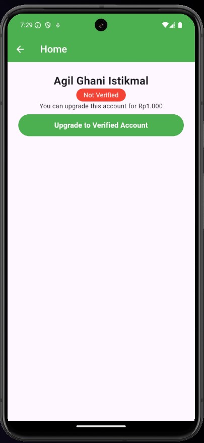
</p>

### Payment

<p align="center">
	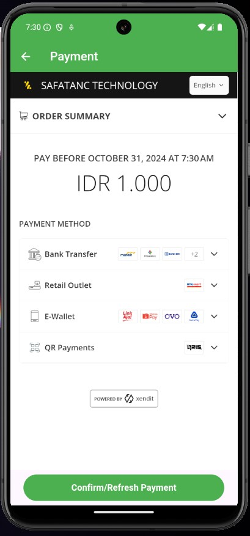
	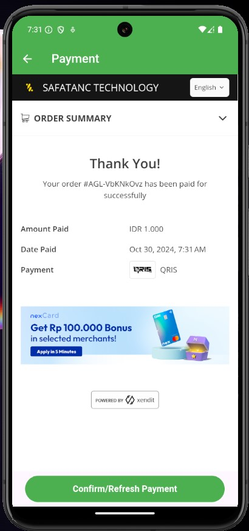
</p>

### Home (Verified)

<p align="center">
	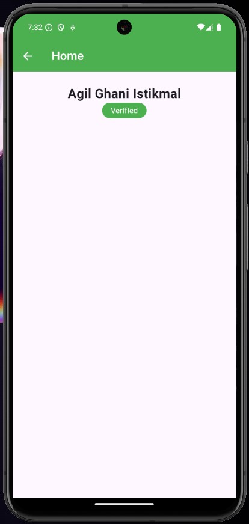
</p>

## API OTP

OTP digunakan untuk mengirim kode verifikasi kepada user. Ini untuk membuktikan bahwa yang mengakses adalah user tersebut untuk mengurangi resiko dihack. <br>
Saya menggunakan [WAHA](https://waha.devlike.pro/) untuk mengirimkan OTP melalui **WhatsApp**. WAHA adalah 3rd party API open source yang dapat mengirimkan pesan melalui whatsapp. Saya menghosting sendiri WAHA di VPS yang dapat diakses melalui https://waha.safatanc.com dengan nomor [+6285888881550](https://wa.me/6285888881550) <br>

### Send OTP

Untuk mengirimkan pesan cukup memanggil API dari WAHA. <br>
Melalui endpoint POST /api/sendText <br>

Contohnya POST https://waha.safatanc.com/api/sendText

```json
{
  "session": "default",
  "chatId": "6281346173829@c.us",
  "text": "Hi there!"
}
```

<p align="center">
	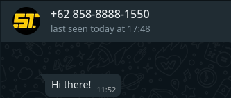
</p>

### Send OTP - Golang

Berikut adalah cara mengirim OTP melalui golang. OTP dikirim saat melakukan register dan login. <br>

1. OTP dibuat dengan 4 digit huruf random
2. OTP disimpan dalam tabel OTP dengan expired time 10 menit
3. OTP dikirim melalui whatsapp ke nomor user

#### OTP Model

```go
package model

import "time"

type OTP struct {
	Username  string    `json:"username,omitempty" gorm:"primaryKey"`
	Code      string    `json:"code,omitempty"`
	ExpiredAt time.Time `json:"expired_at,omitempty"`
	CreatedAt time.Time `json:"created_at,omitempty"`
	UpdatedAt time.Time `json:"updated_at,omitempty"`
}

```

#### OTP Repository

Repository untuk membuat random code dan menyimpannya di database.

```go
package repository

...

func (r *OTPRepository) Create(username string) (*model.OTP, error) {
	code := pkg.RandomString(4)

	otp := &model.OTP{
		Username:  username,
		Code:      code,
		ExpiredAt: time.Now().Add(10 * time.Minute),
	}

	err := r.db.Save(&otp).Error
	if err != nil {
		return nil, err
	}

	return otp, nil
}

```

#### OTP Service

Service untuk logic saat ingin membuat code dan mengirimkannya ke user. <br>
Template message OTP diambil dari file `config.yml`

```go
package service

...

func (s *OTPService) Generate(username string) (*model.OTP, error) {
	user, err := s.userRepository.Find(username)
	if err != nil {
		return nil, err
	}

	otp, err := s.otpRepository.Create(user.Username)
	if err != nil {
		return nil, err
	}

	var otpMessageBuffer bytes.Buffer
	otpMessageTemplate := template.Must(template.New("otp_message").Parse(viper.GetString("otp.message")))
	otpMessageTemplate.Execute(&otpMessageBuffer, map[string]string{
		"Username": otp.Username,
		"Code":     otp.Code,
	})

	otpMessage := strings.ReplaceAll(otpMessageBuffer.String(), "\n", `\n`)

	body := []byte(fmt.Sprintf(`{
		"session": "default",
		"chatId":  "%s",
		"text":    "%s"
	}`, user.Phone[1:]+"@c.us", otpMessage))

	endpoint := viper.GetString("waha.base_url") + "/api/sendText"

	resp, err := http.Post(endpoint, "application/json", bytes.NewBuffer(body))
	if err != nil {
		return nil, err
	}

	if resp.StatusCode != 201 {
		return nil, fmt.Errorf("failed to send otp")
	}

	return otp, nil
}
```

<p align="center">
	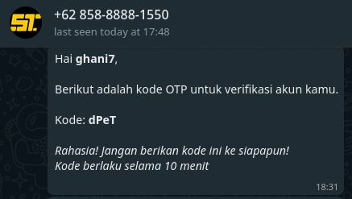
</p>

## API Payment Gateway

Saya menggunakan [Xendit](https://xendit.co) sebagai Payment Gateway. <br>
Dan menggunakan library [Xendit-Go](https://github.com/xendit/xendit-go) untuk menggunakannya di bahasa pemrograman Go.

### Payment Model
```go
package model

import "time"

type Payment struct {
	ID          string `json:"id,omitempty" gorm:"primaryKey"`
	ReferenceID string `json:"reference_id,omitempty" gorm:"unique"`
	Username    string `json:"username,omitempty"`
	Url         string `json:"url,omitempty"`
	Status      string `json:"status,omitempty"`
	Amount      int
	CreatedAt   time.Time `json:"created_at,omitempty"`
	UpdatedAt   time.Time `json:"updated_at,omitempty"`
}

```

### Payment Repository

```go
package repository

import (
	"github.com/agilistikmal/uty-mobile-web-service-api/internal/app/model"
	"gorm.io/gorm"
)

type PaymentRepository struct {
	db *gorm.DB
}

func NewPaymentRepository(db *gorm.DB) *PaymentRepository {
	return &PaymentRepository{
		db: db,
	}
}

func (s *PaymentRepository) Create(payment *model.Payment) (*model.Payment, error) {
	err := s.db.Create(&payment).Error
	if err != nil {
		return nil, err
	}
	return payment, nil
}

func (s *PaymentRepository) Update(id string, payment *model.Payment) (*model.Payment, error) {
	err := s.db.Where("id = ?", id).Updates(&payment).Error
	if err != nil {
		return nil, err
	}
	return payment, nil
}

func (s *PaymentRepository) FindByID(id string) (*model.Payment, error) {
	var payment *model.Payment
	err := s.db.Take(&payment, "id = ?", id).Error
	if err != nil {
		return nil, err
	}
	return payment, nil
}

func (s *PaymentRepository) FindByReferenceID(referenceID string) (*model.Payment, error) {
	var payment *model.Payment
	err := s.db.Take(&payment, "reference_id = ?", referenceID).Error
	if err != nil {
		return nil, err
	}
	return payment, nil
}
```

### Payment Service - Create

Membuat Invoice Xendit dan menyimpannya di database sebagai Payment.

```go
func (s *PaymentService) Create(payment *model.Payment) (*model.Payment, error) {
	err := s.validator.Struct(payment)
	if err != nil {
		return nil, err
	}

	_, err = s.userRepository.Find(payment.Username)
	if err != nil {
		return nil, err
	}

	// Membuat External ID/Reference ID dengan Prefix AGL-RaNdOmStr
	referenceID := "AGL-" + pkg.RandomString(8)

	createInvoiceRequest := *invoice.NewCreateInvoiceRequest(referenceID, float64(payment.Amount))

	invoice, _, xdtErr := s.xenditClient.InvoiceApi.CreateInvoice(context.Background()).
		CreateInvoiceRequest(createInvoiceRequest).
		Execute()
	if xdtErr != nil {
		return nil, xdtErr
	}

	payment = &model.Payment{
		ID:          *invoice.Id,
		ReferenceID: invoice.ExternalId,
		Url:         invoice.InvoiceUrl,
		Username:    payment.Username,
		Amount:      int(invoice.Amount),
		Status:      "PENDING",
	}

	payment, err = s.paymentRepository.Create(payment)
	if err != nil {
		return nil, err
	}

	return payment, nil
}
```

### Payment Service - Find

Ini untuk mencari dan mengecek status pembayaran. Jika sudah dibayar, maka user akan menjadi verified.

```go
func (s *PaymentService) FindByReferenceID(referenceID string) (*model.Payment, error) {
	payment, err := s.paymentRepository.FindByReferenceID(referenceID)
	if err != nil {
		return nil, err
	}

	// Jika pending, maka cek lagi statusnya
	if payment.Status == "PENDING" {
		invoice, _, _ := s.xenditClient.InvoiceApi.GetInvoiceById(context.Background(), payment.ID).Execute()
		payment.Status = string(invoice.Status)
		payment, err = s.paymentRepository.Update(payment.ID, payment)
		if err != nil {
			return nil, err
		}
	}

	// Jika sudah PAID, maka update user menjadi Verified
	if payment.Status == "PAID" {
		user, err := s.userRepository.Find(payment.Username)
		if err != nil {
			return nil, err
		}

		if user.Verified == false {
			user.Verified = true

			_, err = s.userRepository.Update(user.Username, user)
			if err != nil {
				return nil, err
			}
		}
	}

	return payment, nil
}
```

## Integrasi Flutter dan API

Untuk mengintergasikan flutter dan api membutuhkan package HTTP untuk mengirim request melalui protokol HTTP.

### Import HTTP

Tambahkan kode ini di paling atas file untuk import package HTTP

```dart
import 'package:http/http.dart' as http;
```

### Login

Function `login()` ini akan dipanggil saat tombol di klik (`onPressed`).

```dart
Future<void> login() async {
	// mereset state
	setState(() {
		errorMessage = "";
		loading = true;
	});

	// melakukan request ke API yang telah saya hosting untuk melakukan login
	// dengan mengirimkan username dan password sebagai body.
	final rawResponse = await http.post(
		Uri.parse("https://mwsapi.safatanc.com/auth/login"),
		body: jsonEncode(
			{
				"username": usernameController.text,
				"password": passwordController.text
			},
		),
	);

	// Melakukan konversi dari Json -> Map -> Object Model APIResponse
	final Map parseResponse = json.decode(rawResponse.body);
	final response = APIResponse.fromJson(parseResponse);

	if (response.code == 200) {
		// Melakukan konversi dari APIResponse Data -> Object Model User
		final user = User.fromJson(response.data);

		// Mengubah screen ke screen OTP
		Navigator.of(context).push(
			MaterialPageRoute(
				builder: (context) => OTPPage(
					user: user,
				),
			),
		);
	} else {
		// Jika error akan mengubah state errorMessage agar bisa ditampilkan
		setState(() {
			errorMessage = response.message;
		});
	}

	setState(() {
		loading = false;
	});
}
```

### Register

Penggunaan nya mirip seperti Login dari, hanya menyesuaikan endpoint dan body untuk request nya

```dart
Future<void> register() async {
	setState(() {
		errorMessage = "";
	});

	final rawResponse = await http.post(
		Uri.parse("https://mwsapi.safatanc.com/auth/register"),
		body: jsonEncode(
			{
				"username": usernameController.text,
				"password": passwordController.text,
				"full_name": fullNameController.text,
				"phone": phoneController.text
			},
		),
	);

	final Map parseResponse = json.decode(rawResponse.body);
	final response = APIResponse.fromJson(parseResponse);

	if (response.code == 200) {
		Navigator.of(context).pop();
	} else {
		setState(() {
			errorMessage = response.message;
		});
	}
}
```

### OTP Verify

Penggunaan nya mirip seperti Login, hanya menyesuaikan endpoint dan body untuk request nya

```dart
Future<void> verify() async {
	setState(() {
		errorMessage = "";
		loading = true;
	});

	final rawResponse = await http.post(
		Uri.parse("https://mwsapi.safatanc.com/auth/otp"),
		body: jsonEncode(
			{"username": widget.user.username, "code": codeController.text},
		),
	);

	final Map parseResponse = json.decode(rawResponse.body);

	final response = APIResponse.fromJson(parseResponse);

	if (response.code == 200) {
		Navigator.of(context).pushReplacement(
			MaterialPageRoute(
				builder: (context) => HomePage(user: widget.user),
			),
		);
	} else {
		setState(() {
			errorMessage = response.message;
		});
	}

	setState(() {
		loading = false;
	});
}
```

### Upgrade Account (Create Payment)

Disini user akan menklik tombol upgrade untuk melakukan pembayaran. <br>
Data payment akan dikirim ke halaman PaymentPage untuk menampilkan halaman pembayaran dari Xendit (Payment Gateway).

```dart
Future<void> upgrade() async {
	setState(() {
		errorMessage = "";
		loading = true;
	});

	final rawResponse = await http.post(
		Uri.parse("https://mwsapi.safatanc.com/payment"),
		body: jsonEncode(
			{"username": widget.user.username, "amount": 1000},
		),
	);

	final Map parseResponse = json.decode(rawResponse.body);

	final response = APIResponse.fromJson(parseResponse);

	if (response.code == 200) {
		final payment = Payment.fromJson(response.data);

		Navigator.of(context).push(
			MaterialPageRoute(
				builder: (context) =>
						PaymentPage(user: widget.user, payment: payment),
			),
		);
	} else {
		setState(() {
			errorMessage = response.message;
		});
	}

	setState(() {
		loading = false;
	});
}
```

### WebView Xendit/Payment

```dart
@override
Widget build(BuildContext context) {
	// Menyiapkan controller untuk halaman xendit
	final controller = WebViewController()
		..setJavaScriptMode(JavaScriptMode.unrestricted)
		..loadRequest(Uri.parse(widget.payment.url));

	return Scaffold(
		...
		body: Column(
			children: [
				Expanded(
					// Menampilkan halaman Xendit
					child: WebViewWidget(controller: controller),
				),
				...
			],
		),
	);
}
```

### Confirm/Refresh Payment Status

Berbeda dengan sebelumnya, disini hanya menggunakan method GET dan tidak memerlukan body. <br>

Saat status payment sudah tidak PENDING, maka user akan di redirect kembali ke halaman Home.

```dart
Future<void> check() async {
	setState(() {
		errorMessage = "";
		loading = true;
	});

	// Menggunakan GET saja
	final rawResponse = await http.get(
		Uri.parse(
			"https://mwsapi.safatanc.com/payment/reference_id/${widget.payment.referenceId}",
		),
	);

	final Map parseResponse = json.decode(rawResponse.body);

	final response = APIResponse.fromJson(parseResponse);

	if (response.code == 200) {
		final payment = Payment.fromJson(response.data);

		if (payment.status != "PENDING") {
			Navigator.of(context).pop();
		}
	} else {
		setState(() {
			errorMessage = response.message;
		});
	}

	setState(() {
		loading = false;
	});
}
```

## Referensi

https://developers.xendit.co/api-reference/ <br>
https://github.com/xendit/xendit-go <br>
https://docs.flutter.dev/ui/widgets <br>
https://waha.devlike.pro/ <br>
https://github.com/khannedy/golang-clean-architecture <br>
https://gorm.io/ <br>

# Referensi Keseluruhan

https://api.flutter.dev/flutter/widgets/widgets-library.html <br>
https://api.flutter.dev/flutter/widgets/widgets-library.html <br>
https://medium.com/@marketing_96275/how-to-create-and-design-buttons-in-flutter-81e87f709348 <br>
https://api.flutter.dev/flutter/widgets/widgets-library.html <br>
https://stackoverflow.com/questions/51513429/how-to-do-rounded-corners-image-in-flutter <br>
https://stackoverflow.com/questions/50287995/passing-data-to-statefulwidget-and-accessing-it-in-its-state-in-flutter
<br>
https://developers.xendit.co/api-reference/ <br>
https://github.com/xendit/xendit-go <br>
https://docs.flutter.dev/ui/widgets <br>
https://waha.devlike.pro/ <br>
https://github.com/khannedy/golang-clean-architecture <br>
https://gorm.io/ <br>